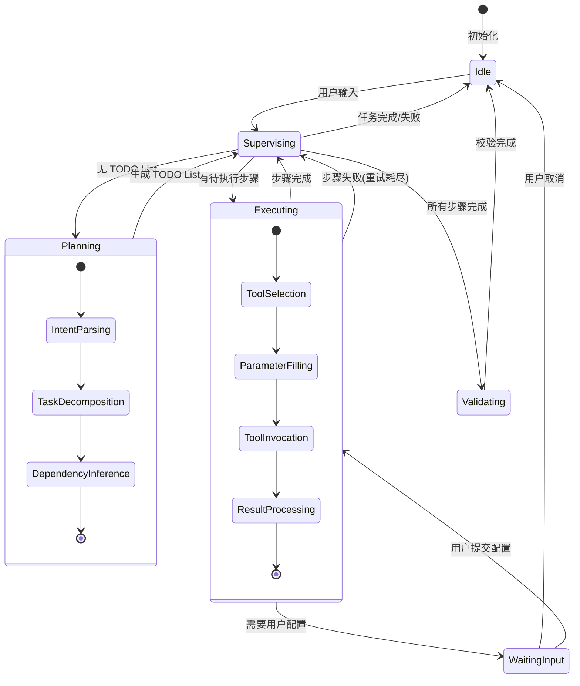

# WINS Agent 软件设计文档

> 版本：1.0 | 作者：系统架构师 | 日期：2026-01-20

---

## 目录

1. [系统概述](#1-系统概述)
2. [系统架构设计](#2-系统架构设计)
3. [Agent 工作流设计](#3-agent-工作流设计)
4. [数据模型设计](#4-数据模型设计)
5. [API 接口设计](#5-api-接口设计)
6. [前端架构设计](#6-前端架构设计)
7. [知识库与 RAG 设计](#7-知识库与-rag-设计)
8. [Tool 注册与编排设计](#8-tool-注册与编排设计)
9. [Human-in-the-Loop 设计](#9-human-in-the-loop-设计)
10. [部署架构设计](#10-部署架构设计)

---

## 1. 系统概述

### 1.1 系统定位

WINS Agent 是一个基于 LangGraph 1.0 的智能任务编排平台，专为领域知识密集型场景设计，支持复杂业务系统的自然语言交互与自动化任务执行。

### 1.2 核心能力矩阵

| 能力域 | 核心功能 | 技术支撑 |
|--------|----------|----------|
| **意图理解** | 自然语言解析、多轮对话、上下文保持 | LLM + Prompt Engineering |
| **知识检索** | 领域术语、系统文档、历史案例 | FAISS + RAG Pipeline |
| **任务编排** | 依赖分析、并行调度、失败重试 | LangGraph StateGraph |
| **参数填充** | 智能推断、知识增强、用户确认 | RAG + Human-in-the-Loop |
| **进度追踪** | 实时状态、步骤可视化、错误归因 | SSE + React State |

### 1.3 设计约束

```
┌─────────────────────────────────────────────────────────────┐
│                      设计约束矩阵                            │
├─────────────────┬───────────────────────────────────────────┤
│ 响应时间        │ 首字输出 < 2s，完整响应 < 30s             │
│ 并发能力        │ 单实例支持 100 并发会话                    │
│ 上下文窗口      │ 保留最近 4000 tokens                       │
│ 任务步骤        │ 单任务最大 20 步                           │
│ 重试策略        │ 单步最多 3 次重试                          │
│ Tool 超时       │ 单次调用 < 60s                             │
└─────────────────┴───────────────────────────────────────────┘
```

---

## 2. 系统架构设计

### 2.1 分层架构视图


### 2.2 组件交互视图


### 2.3 技术组件依赖图


---

## 3. Agent 工作流设计

### 3.1 主状态机设计



### 3.2 Supervisor 路由决策树


### 3.3 任务执行流程（带重试）


### 3.4 SubGraph 嵌套结构


---

## 4. 数据模型设计

### 4.1 核心实体关系图


### 4.2 Agent State 结构设计


### 4.3 Checkpoint 存储结构


---

## 5. API 接口设计

### 5.1 RESTful API 结构


### 5.2 SSE 事件流设计


### 5.3 核心接口契约

```yaml
# Chat Send Request
ChatRequest:
  message: string (required)
  thread_id: string (optional)
  config_response: object (optional)

# Chat Response
ChatResponse:
  thread_id: string
  message: ChatMessage
  todo_list: TodoStep[]
  pending_config: PendingConfig | null
  task_status: TaskStatus

# SSE Event Types
SSEEvent:
  type: "update" | "interrupt" | "error" | "done"
  thread_id: string
  data:
    node?: string
    content?: string
    todo_list?: TodoStep[]
    status?: string
    pending_config?: PendingConfig
    error?: string
```

---

## 6. 前端架构设计

### 6.1 组件层次结构


### 6.2 状态管理架构


### 6.3 数据流向图


### 6.4 响应式布局断点

```
┌─────────────────────────────────────────────────────────────────┐
│                     Desktop (≥1280px)                           │
│  ┌──────────┬────────────────────────────────┬─────────────┐   │
│  │ Sidebar  │         Chat Area              │  TaskPanel  │   │
│  │  288px   │          flex-1                │    320px    │   │
│  └──────────┴────────────────────────────────┴─────────────┘   │
└─────────────────────────────────────────────────────────────────┘

┌─────────────────────────────────────────────────────────────────┐
│                     Tablet (768px-1279px)                       │
│  ┌──────────┬────────────────────────────────────────────┐     │
│  │ Sidebar  │              Chat Area                     │     │
│  │  240px   │              flex-1                        │     │
│  └──────────┴────────────────────────────────────────────┘     │
│  [TaskPanel 折叠为底部抽屉]                                      │
└─────────────────────────────────────────────────────────────────┘

┌─────────────────────────────────────────────────────────────────┐
│                     Mobile (<768px)                             │
│  ┌─────────────────────────────────────────────────────────┐   │
│  │                    Chat Area                            │   │
│  │                    full width                           │   │
│  └─────────────────────────────────────────────────────────┘   │
│  [Sidebar 变为汉堡菜单] [TaskPanel 变为浮动按钮]                  │
└─────────────────────────────────────────────────────────────────┘
```

---

## 7. 知识库与 RAG 设计

### 7.1 RAG Pipeline 架构


### 7.2 知识类型与检索策略


### 7.3 上下文窗口管理


---

## 8. Tool 注册与编排设计

### 8.1 Tool 生命周期


### 8.2 Tool Schema 设计规范


### 8.3 依赖编排算法

```mermaid
flowchart TD
    START[开始编排] --> PARSE[解析任务步骤]
    PARSE --> BUILD[构建依赖图]
    
    BUILD --> TOPO[拓扑排序]
    TOPO --> VALID{有环?}
    
    VALID -->|是| ERROR[报告循环依赖]
    VALID -->|否| LEVEL[划分执行层级]
    
    LEVEL --> L0[Level 0: 无依赖步骤]
    LEVEL --> L1[Level 1: 依赖 L0]
    LEVEL --> LN[Level N: 依赖 LN_1]
    
    L0 --> PARALLEL[同层可并行]
    L1 --> PARALLEL
    LN --> PARALLEL
    
    PARALLEL --> SCHEDULE[调度执行]
```

```
示例依赖图:
┌─────────────────────────────────────────────────┐
│  Step1 ──┬──► Step3 ──► Step5                   │
│          │                                      │
│  Step2 ──┴──► Step4 ──┘                         │
│                                                 │
│  Level 0: [Step1, Step2]  (可并行)              │
│  Level 1: [Step3, Step4]  (可并行)              │
│  Level 2: [Step5]                               │
└─────────────────────────────────────────────────┘
```

### 8.4 参数填充策略

```mermaid
flowchart TD
    PARAM[待填充参数] --> SOURCE{参数来源}
    
    SOURCE -->|显式上下文| CTX[从对话/状态提取]
    SOURCE -->|知识检索| RAG[RAG 检索相关知识]
    SOURCE -->|前置步骤| PREV[从依赖步骤结果]
    SOURCE -->|用户配置| USER[触发配置表单]
    SOURCE -->|默认值| DEF[使用 Schema 默认]
    
    CTX --> MERGE[参数合并]
    RAG --> MERGE
    PREV --> MERGE
    USER --> MERGE
    DEF --> MERGE
    
    MERGE --> VALIDATE{校验完整性}
    VALIDATE -->|通过| READY[参数就绪]
    VALIDATE -->|缺失必填| USER
```

---

## 9. Human-in-the-Loop 设计

### 9.1 中断触发场景

```mermaid
graph TB
    subgraph "主动中断"
        A1[敏感操作审批]
        A2[必填参数缺失]
        A3[多选项确认]
        A4[执行前预览]
    end
    
    subgraph "被动中断"
        B1[Tool 执行失败]
        B2[超时重试]
        B3[资源不可用]
    end
    
    subgraph "中断处理"
        A1 & A2 & A3 & A4 --> INT[interrupt]
        B1 & B2 & B3 --> INT
        
        INT --> PEND[设置 pending_config]
        PEND --> SSE[发送 interrupt 事件]
        SSE --> UI[前端显示表单]
    end
    
    subgraph "恢复处理"
        UI --> SUBMIT[用户提交]
        SUBMIT --> RESUME[resume]
        RESUME --> CONTINUE[继续执行]
    end
```

### 9.2 配置表单动态生成

```mermaid
flowchart LR
    subgraph "Schema 解析"
        TOOL_SCHEMA[Tool Args Schema] --> PARSE[解析 Pydantic]
        PARSE --> FIELDS[提取字段]
    end
    
    subgraph "字段映射"
        FIELDS --> MAP{字段类型}
        MAP -->|str| TEXT[TextInput]
        MAP -->|int/float| NUM[NumberInput]
        MAP -->|bool| SWITCH[Switch]
        MAP -->|Literal| SELECT[Select]
        MAP -->|List| CHIPS[Chips]
        MAP -->|Optional| OPT[标记可选]
    end
    
    subgraph "表单渲染"
        TEXT & NUM & SWITCH & SELECT & CHIPS --> FORM[ConfigModal]
        OPT --> FORM
        FORM --> VALID[客户端校验]
        VALID --> SUBMIT[提交]
    end
```

### 9.3 审批工作流

```mermaid
sequenceDiagram
    participant E as Executor
    participant S as State
    participant F as Frontend
    participant U as User
    
    E->>E: 检测到敏感操作
    E->>S: interrupt({action, step_id, ...})
    S->>S: 保存 pending_writes
    S-->>F: SSE event: interrupt
    
    F->>F: 渲染审批界面
    F->>U: 显示操作详情
    
    alt 用户批准
        U->>F: 点击确认
        F->>S: POST /resume (approved: true)
        S->>E: Command(resume)
        E->>E: 继续执行 Tool
    else 用户拒绝
        U->>F: 点击取消
        F->>S: POST /resume (approved: false)
        S->>S: 更新状态为 cancelled
    else 用户修改
        U->>F: 修改参数
        F->>S: POST /resume (modified_args)
        S->>E: Command(resume, update)
        E->>E: 使用新参数执行
    end
```

---

## 10. 部署架构设计

### 10.1 容器化部署架构

```mermaid
graph TB
    subgraph "Kubernetes Cluster"
        subgraph "Ingress"
            ING[Nginx Ingress]
        end
        
        subgraph "Frontend Pods"
            FE1[React App]
            FE2[React App]
        end
        
        subgraph "Backend Pods"
            BE1[FastAPI]
            BE2[FastAPI]
            BE3[FastAPI]
        end
        
        subgraph "Data Layer"
            REDIS[(Redis Cluster)]
            MYSQL[(MySQL Primary)]
            MYSQL_R[(MySQL Replica)]
            FAISS[(FAISS Index<br/>PVC)]
        end
        
        subgraph "External"
            DASH[DashScope API]
            BIZ[业务系统 API]
        end
    end
    
    ING --> FE1 & FE2
    ING --> BE1 & BE2 & BE3
    BE1 & BE2 & BE3 --> REDIS
    BE1 & BE2 & BE3 --> MYSQL
    BE1 & BE2 & BE3 --> FAISS
    BE1 & BE2 & BE3 --> DASH
    BE1 & BE2 & BE3 --> BIZ
    MYSQL --> MYSQL_R
```

### 10.2 高可用设计

```mermaid
graph LR
    subgraph "负载均衡"
        LB[Load Balancer]
    end
    
    subgraph "应用层 HA"
        LB --> APP1[Instance 1]
        LB --> APP2[Instance 2]
        LB --> APP3[Instance 3]
    end
    
    subgraph "数据层 HA"
        APP1 & APP2 & APP3 --> REDIS_C[Redis Sentinel]
        REDIS_C --> REDIS_M[(Master)]
        REDIS_C --> REDIS_S1[(Slave 1)]
        REDIS_C --> REDIS_S2[(Slave 2)]
        
        APP1 & APP2 & APP3 --> MYSQL_P[(MySQL Primary)]
        MYSQL_P --> MYSQL_S[(MySQL Standby)]
    end
    
    subgraph "故障转移"
        REDIS_M -.->|自动切换| REDIS_S1
        MYSQL_P -.->|手动/自动切换| MYSQL_S
    end
```

### 10.3 监控与可观测性

```mermaid
graph TB
    subgraph "应用指标"
        APP[Application]
        APP --> PROM[Prometheus]
        APP --> TRACE[Jaeger Tracing]
        APP --> LOG[Loki Logs]
    end
    
    subgraph "业务指标"
        BIZ_M[业务埋点]
        BIZ_M --> |对话数| PROM
        BIZ_M --> |任务完成率| PROM
        BIZ_M --> |Tool 调用统计| PROM
        BIZ_M --> |LLM 延迟| PROM
    end
    
    subgraph "可视化"
        PROM --> GRAFANA[Grafana]
        TRACE --> GRAFANA
        LOG --> GRAFANA
    end
    
    subgraph "告警"
        GRAFANA --> ALERT[AlertManager]
        ALERT --> NOTIFY[通知渠道]
    end
```

---

## 附录 A: 设计决策记录 (ADR)

### ADR-001: 选择 LangGraph 而非 AutoGen

**状态**: 已采纳

**上下文**: 需要选择 Multi-Agent 框架

**决策**: 采用 LangGraph 1.0

**理由**:
1. 原生支持 Checkpoint 持久化
2. 与 LangChain 生态深度集成
3. StateGraph 提供细粒度控制
4. Human-in-the-Loop 原生支持

### ADR-002: 前端状态管理选择

**状态**: 已采纳

**上下文**: 需要管理复杂的聊天和任务状态

**决策**: Zustand + TanStack Query

**理由**:
1. Zustand 轻量且符合 React 习惯
2. TanStack Query 处理服务端状态缓存
3. 避免 Redux 的样板代码

### ADR-003: SSE vs WebSocket

**状态**: 已采纳

**上下文**: 实现流式输出

**决策**: 使用 SSE (Server-Sent Events)

**理由**:
1. 单向流满足需求
2. 原生 HTTP，无需额外协议
3. 自动重连机制
4. 更简单的服务端实现

---

## 附录 B: 术语表

| 术语 | 定义 |
|------|------|
| Thread | LangGraph 会话线程，关联一组 Checkpoint |
| Checkpoint | 状态快照，每个 super-step 后自动保存 |
| Super-step | 图执行的一个完整步骤（节点执行 + 状态更新） |
| Handoff | Agent 间任务交接机制 |
| Interrupt | Human-in-the-Loop 中断点 |
| Tool | 使用 @tool 装饰器封装的可调用函数 |
| RAG | Retrieval-Augmented Generation，检索增强生成 |

---

*文档结束*
