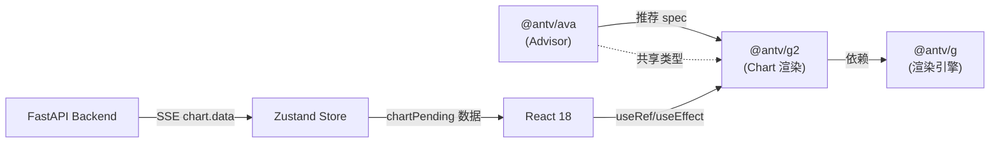
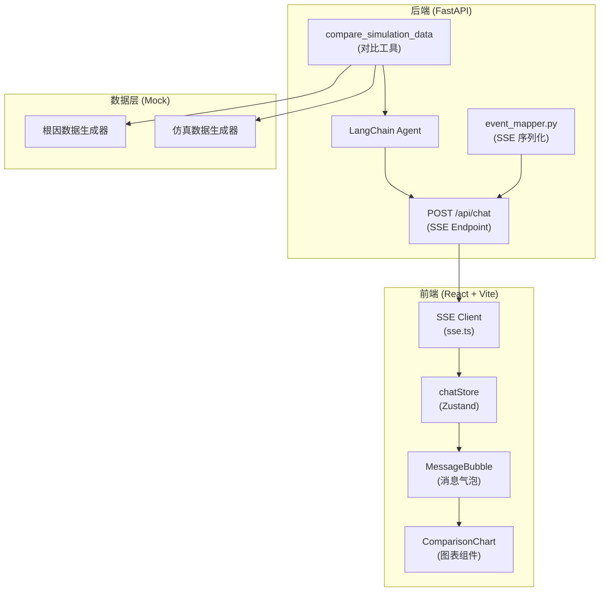
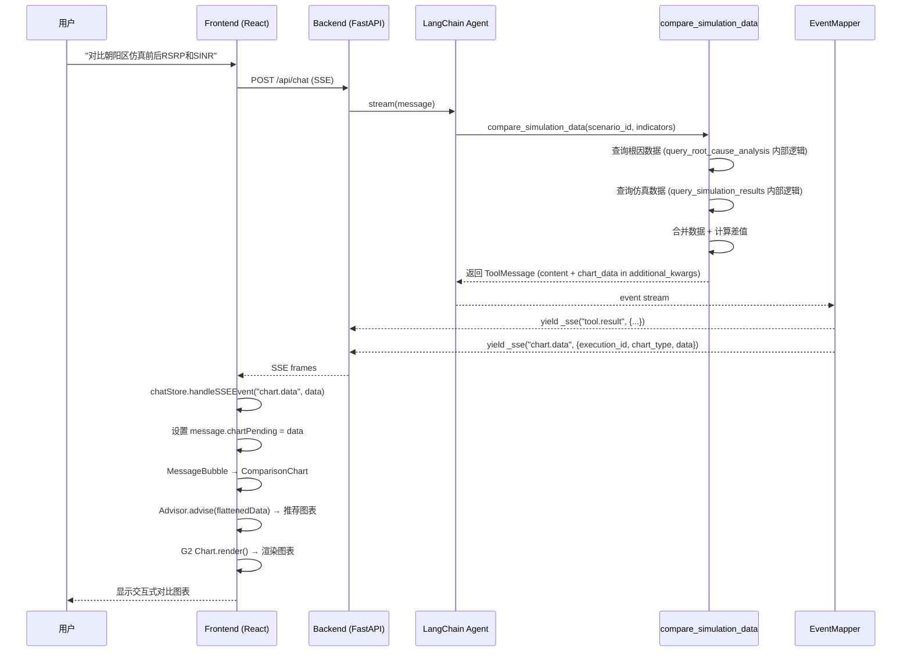
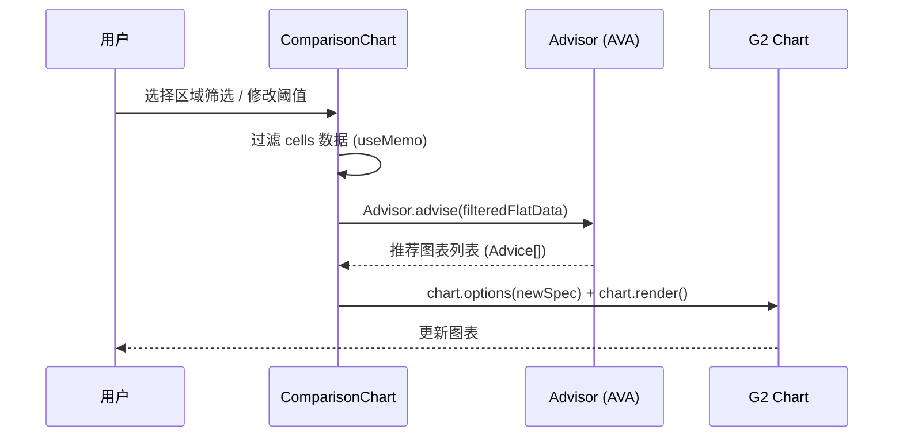
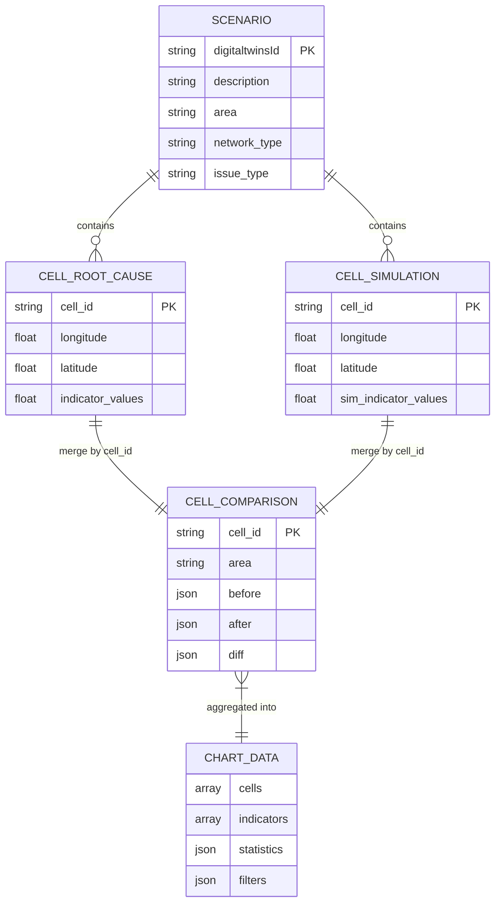

# 技术解决方案与开发计划 — 图表可视化

## 一、解决方案

### 1. 系统概述

- **系统定位**: 在现有 WINS Agent Workstation 对话流中嵌入图表可视化能力，使用户能够以图形方式对比仿真前后网络性能指标，补充当前纯表格展示的局限。
- **核心能力矩阵**:

| 能力域 | 核心功能 | 技术支撑 |
| :--- | :--- | :--- |
| 数据对比 | 自动合并根因与仿真数据、计算差值 | Python `compare_simulation_data` 工具 |
| 智能推荐 | 根据数据特征自动推荐最佳图表类型 | `@antv/ava` Advisor.advise() |
| 图表渲染 | 分组柱状图、折线图等交互式图表 | `@antv/g2` Chart + interval/dodgeX |
| 筛选过滤 | 区域筛选、指标筛选、阈值过滤 | React 状态管理 + 数据过滤 |
| SSE 推送 | 图表数据实时推送到前端 | `chart.data` SSE 事件 |

- **设计约束**:
  - 功能约束: 仅支持 cell 级别仿真前后对比（与 PRD 一致）；指标基于现有 `CELL_ROOT_CAUSE_INDICATORS` / `CELL_SIMULATION_INDICATORS` 交集
  - 性能规格: 支持 ≤1000 小区数据渲染；筛选响应 < 300ms；图表初始化 < 1s

---

### 2. 三方件选型与兼容性分析

#### 2.1 选型决策记录 (ADR)

| 组件类别 | 待选方案 | 最终选型 | 理由 (Why) | 潜在风险 |
| :--- | :--- | :--- | :--- | :--- |
| 图表推荐引擎 | @antv/ava vs 手动规则映射 | **@antv/ava** | Advisor.advise() 可根据数据结构自动推荐图表类型和配置，支持 Purpose("Comparison") 精准匹配对比场景；降低前端硬编码 | 包体积增加；推荐结果可能不匹配极端数据 |
| 图表渲染库 | @antv/g2 vs ECharts vs Recharts | **@antv/g2** | 与 AVA 同属 AntV 生态系统，Advisor 输出的 spec 可直接用于 G2 渲染；声明式 API (`chart.options()`) 适合动态数据；dodgeX transform 原生支持分组柱状图 | 学习曲线较 ECharts 略陡；需手动管理 React 中的生命周期 |

**关于 ECharts 和 Recharts 未选理由**：
- **ECharts**: 与 AVA 输出的 spec 格式不兼容，需要额外转换层；包体积大（~800KB min）
- **Recharts**: React 原生但与 AVA 无生态联动；定制化能力弱于 G2

#### 2.2 技术栈兼容性矩阵

| 核心组件 | 推荐版本 | 兼容性要求/依赖 | 说明 |
| :--- | :--- | :--- | :--- |
| **React** | ^18.3.1 | 已有 ✅ | 项目现有版本，无变更 |
| **TypeScript** | ^5.6.3 | 已有 ✅ | 项目现有版本，无变更 |
| **Vite** | ^5.4.11 | 已有 ✅ | 项目现有版本，无变更 |
| **@antv/ava** | ^3.x | 需 ES2020+，兼容 Vite 5 | 新增依赖；核心类 `Advisor`；约 150KB gzipped |
| **@antv/g2** | ^5.x | 需 ES2020+，兼容 Vite 5；依赖 `@antv/g`（自动引入） | 新增依赖；声明式 API；约 200KB gzipped |
| **Python** | 3.10+ | 已有 ✅ | 后端无新增依赖 |
| **LangChain** | 1.2.5 | 已有 ✅ | 工具注册机制不变 |

#### 2.3 选型拓扑图



---

### 3. 系统架构设计

#### 3.1 分层架构视图



#### 3.2 组件交互视图

```mermaid
graph LR
    subgraph Backend
        A[compare_simulation_data] -->|附加 chart_data 到 ToolMessage| B[event_mapper.py]
        B -->|yield _sse 'chart.data'| C[SSE Stream]
    end

    subgraph Frontend
        C -->|fetch ReadableStream| D[sse.ts]
        D -->|onEvent callback| E[chatStore.handleSSEEvent]
        E -->|设置 msg.chartPending| F[MessageBubble]
        F -->|渲染| G[ComparisonChart]
        G -->|Advisor.advise| H[AVA 推荐]
        H -->|chart type + spec| I[G2 Chart render]
    end
```



---

### 4. 核心业务流

#### 4.1 图表生成全流程（时序图）



#### 4.2 用户筛选交互流程



---

### 5. 数据模型设计

#### 5.1 核心数据流转 ER 图



#### 5.2 后端 SSE 事件数据结构

```python
# chart.data SSE 事件 payload
{
    "execution_id": "uuid-string",           # 关联 tool.result 的 execution_id
    "chart_type": "grouped_bar",             # 推荐的默认图表类型
    "data": {
        "cells": [
            {
                "cell_id": "460-00-100001",
                "area": "朝阳",
                "before": {"RSRP均值(dBm)": -85.2, "SINR均值(dB)": 12.5},
                "after":  {"RSRP均值(dBm)": -82.1, "SINR均值(dB)": 15.2},
                "diff":   {"RSRP均值(dBm)": 3.1,   "SINR均值(dB)": 2.7}
            }
            # ... more cells
        ],
        "indicators": ["RSRP均值(dBm)", "SINR均值(dB)"],
        "statistics": {
            "by_area": {
                "朝阳": {
                    "before_avg": {"RSRP均值(dBm)": -87.5, "SINR均值(dB)": 11.2},
                    "after_avg":  {"RSRP均值(dBm)": -81.3, "SINR均值(dB)": 16.1},
                    "diff_avg":   {"RSRP均值(dBm)": 6.2,   "SINR均值(dB)": 4.9}
                }
            },
            "summary": {
                "avg_improvement": {"RSRP均值(dBm)": 5.8, "SINR均值(dB)": 4.2}
            }
        },
        "filters": {
            "areas": ["朝阳", "海淀", "浦东", "西湖", "天河"],
            "threshold": 1.0
        }
    }
}
```

#### 5.3 前端类型定义

```typescript
// === 新增类型（frontend/src/types/index.ts）===

export interface CellComparisonData {
  cell_id: string;
  area: string;
  before: Record<string, number>;
  after: Record<string, number>;
  diff: Record<string, number>;
}

export interface ChartData {
  cells: CellComparisonData[];
  indicators: string[];
  statistics: {
    by_area: Record<string, {
      before_avg: Record<string, number>;
      after_avg: Record<string, number>;
      diff_avg: Record<string, number>;
    }>;
    summary: {
      avg_improvement: Record<string, number>;
    };
  };
  filters: {
    areas: string[];
    threshold: number;
  };
}

export interface ChartPending {
  execution_id: string;
  chart_type: string;
  data: ChartData;
}
```

#### 5.4 SSEEventType 扩展

```typescript
// 新增到 SSEEventType union
export type SSEEventType =
  | "session"
  | "thinking"
  | "tool.call"
  | "tool.result"
  | "table.data"
  | "chart.data"   // ← 新增
  | "hitl.pending"
  | "params.pending"
  | "todo.state"
  | "message"
  | "suggestions"
  | "error"
  | "done";
```

#### 5.5 Message 接口扩展

```typescript
export interface Message {
  id: string;
  role: "user" | "assistant" | "tool";
  content: string;
  toolCalls?: ToolCallInfo[];
  todoSteps?: TodoStep[];
  hitlPending?: HITLPending;
  paramsPending?: ParamsPending;
  suggestions?: SuggestionGroup;
  chartPending?: ChartPending;    // ← 新增：图表数据
  isStreaming?: boolean;
  timestamp: number;
}
```

---

### 6. API / SSE 接口设计

本功能不新增 REST API 端点，仅扩展 SSE 事件类型。

#### 6.1 SSE 事件接口矩阵

| 事件类型 | 方向 | 触发时机 | Payload 结构 | 变更类型 |
| :--- | :--- | :--- | :--- | :--- |
| `chart.data` | Backend → Frontend | `compare_simulation_data` 工具返回 ToolMessage 后 | `{execution_id, chart_type, data: ChartData}` | **新增** |
| `tool.call` | Backend → Frontend | Agent 调用 compare_simulation_data 时 | 无变更 | 不变 |
| `tool.result` | Backend → Frontend | compare_simulation_data 返回文本摘要 | 无变更 | 不变 |

#### 6.2 `chart.data` 事件发送逻辑

复用 `table.data` 的发送模式 —— 通过 `ToolMessage.additional_kwargs["chart_data"]` 附带图表数据：

```python
# event_mapper.py 中的处理逻辑（参考 table.data 模式）
elif isinstance(msg, ToolMessage):
    # ... 现有 tool.result 处理 ...

    # chart.data：对比图表数据
    chart_data = msg.additional_kwargs.get("chart_data")
    if chart_data:
        yield _sse("chart.data", {
            "execution_id": exec_id,
            "chart_type": chart_data.get("chart_type", "grouped_bar"),
            "data": chart_data.get("data", {}),
        })
```

---

### 7. 前端架构设计

#### 7.1 组件树

```
MessageBubble (已有)
├── ToolCallCards (已有)
├── HITLInlineCard (已有)
├── ParamsInlineCard (已有)
├── TodoStepper (已有)
├── **ComparisonChart** (新增) ← 当 message.chartPending 存在时渲染
│   ├── ChartToolbar (筛选工具栏)
│   │   ├── AreaSelector (区域下拉)
│   │   ├── IndicatorCheckboxes (指标复选)
│   │   ├── ThresholdSlider (阈值滑块)
│   │   └── ChartTypeSwitcher (图表类型切换)
│   ├── G2ChartRenderer (G2 图表容器)
│   └── StatsSummary (统计摘要)
├── MessageContent (已有)
└── SuggestionChips (已有)
```

#### 7.2 状态管理

**chatStore 扩展（Zustand）**：

```typescript
// handleSSEEvent 新增 case
case "chart.data": {
  if (last && last.role === "assistant") {
    const chartData: ChartPending = {
      execution_id: data.execution_id as string,
      chart_type: data.chart_type as string,
      data: data.data as ChartData,
    };
    // 关联到对应 toolCall
    last.toolCalls = (last.toolCalls ?? []).map((tc) =>
      tc.execution_id === chartData.execution_id
        ? { ...tc, chartPending: chartData }
        : tc
    );
    // 同时设置到 message 级别用于独立渲染
    last.chartPending = chartData;
    msgs[lastIdx] = last;
  }
  return { messages: msgs };
}
```

#### 7.3 ComparisonChart 组件核心逻辑

```typescript
// frontend/src/components/chart/ComparisonChart.tsx

import { useRef, useEffect, useState, useMemo } from "react";
import { Chart } from "@antv/g2";
import { Advisor } from "@antv/ava";
import type { ChartPending, CellComparisonData } from "../../types";

interface Props {
  chartPending: ChartPending;
}

export default function ComparisonChart({ chartPending }: Props) {
  const containerRef = useRef<HTMLDivElement>(null);
  const chartRef = useRef<Chart | null>(null);

  // 筛选状态
  const [selectedAreas, setSelectedAreas] = useState<string[]>([]);
  const [selectedIndicators, setSelectedIndicators] = useState<string[]>([]);
  const [threshold, setThreshold] = useState(chartPending.data.filters.threshold);
  const [chartTypeIndex, setChartTypeIndex] = useState(0);

  // 初始化时默认选中全部
  useEffect(() => {
    setSelectedAreas(chartPending.data.filters.areas);
    setSelectedIndicators(chartPending.data.indicators);
  }, [chartPending]);

  // 过滤后的数据
  const filteredCells = useMemo(() => {
    return chartPending.data.cells.filter((cell) => {
      const areaMatch = selectedAreas.length === 0 || selectedAreas.includes(cell.area);
      const thresholdMatch = selectedIndicators.some(
        (ind) => Math.abs(cell.diff[ind] ?? 0) >= threshold
      );
      return areaMatch && thresholdMatch;
    });
  }, [chartPending.data.cells, selectedAreas, selectedIndicators, threshold]);

  // 将 cells 展平为 G2 / AVA 需要的扁平数据格式
  const flatData = useMemo(() => {
    const rows: Record<string, unknown>[] = [];
    for (const cell of filteredCells) {
      for (const ind of selectedIndicators) {
        rows.push({
          cell_id: cell.cell_id,
          area: cell.area,
          indicator: ind,
          stage: "优化前",
          value: cell.before[ind] ?? 0,
        });
        rows.push({
          cell_id: cell.cell_id,
          area: cell.area,
          indicator: ind,
          stage: "优化后",
          value: cell.after[ind] ?? 0,
        });
      }
    }
    return rows;
  }, [filteredCells, selectedIndicators]);

  // AVA 智能推荐
  const adviceList = useMemo(() => {
    if (flatData.length === 0) return [];
    const advisor = new Advisor();
    return advisor.advise({
      data: flatData,
      options: {
        purpose: "Comparison",
        refine: true,
        theme: { primaryColor: "#A78BFA" },  // 使用项目 Primary 色
      },
    });
  }, [flatData]);

  // G2 渲染
  useEffect(() => {
    if (!containerRef.current || flatData.length === 0) return;

    // 销毁旧图表
    if (chartRef.current) {
      chartRef.current.destroy();
      chartRef.current = null;
    }

    const chart = new Chart({
      container: containerRef.current,
      autoFit: true,
    });

    // 如果 AVA 有推荐结果，使用推荐；否则 fallback 到分组柱状图
    if (adviceList.length > 0 && adviceList[chartTypeIndex]) {
      // AVA 推荐的 spec 可能需要适配
      // 降级方案：直接使用 grouped bar
    }

    // 默认 / fallback: 分组柱状图
    chart.options({
      type: "interval",
      data: flatData,
      encode: {
        x: "cell_id",
        y: "value",
        color: "stage",
      },
      transform: [{ type: "dodgeX" }],
      scale: {
        x: { type: "band", padding: 0.2 },
        color: { range: ["#60A5FA", "#34D399"] },  // 项目 Secondary + Success 色
      },
      axis: {
        x: { title: "小区", labelAutoRotate: true },
        y: { title: "指标值" },
      },
      interaction: { tooltip: true },
    });

    chart.render();
    chartRef.current = chart;

    return () => {
      chart.destroy();
    };
  }, [flatData, adviceList, chartTypeIndex]);

  // ... 渲染 JSX：ChartToolbar + 图表容器 + StatsSummary
}
```

#### 7.4 G2 在 React 中的生命周期管理

基于 Context7 获取的 G2 官方 React 集成模式：

| 生命周期 | 处理方式 |
| :--- | :--- |
| 挂载 | `useEffect` 中 `new Chart({ container: ref.current })`，调用 `chart.render()` |
| 数据更新 | 检测 `flatData` 变化，先 `chart.destroy()` 再重新创建（G2 v5 推荐方式） |
| 卸载 | `useEffect` cleanup 中调用 `chart.destroy()` 并置 `null` |

#### 7.5 AVA Advisor 使用方式

基于 Context7 获取的 AVA 官方文档：

```typescript
import { Advisor } from "@antv/ava";

const advisor = new Advisor();
const results = advisor.advise({
  data: flatData,             // 扁平化的 Record<string, unknown>[]
  options: {
    purpose: "Comparison",    // PURPOSE_OPTIONS 枚举，精准匹配"对比"场景
    refine: true,             // 启用规则优化
    theme: { primaryColor: "#A78BFA" },
  },
});

// results: Advice[] — 按 score 降序排列
// results[0].type   → 推荐图表类型，如 "grouped_bar_chart"
// results[0].spec   → 图表 spec 配置
// results[0].score  → 推荐得分
```

---

### 8. 关键特性设计

#### 8.1 后端 — `compare_simulation_data` 工具

```python
# backend/app/agent/tools/telecom_tools.py 新增

# 指标映射：根因指标 → 仿真指标
INDICATOR_MAPPING = {
    "RSRP均值(dBm)":     "仿真RSRP均值(dBm)",
    "SINR均值(dB)":      "仿真SINR均值(dB)",
    "MR覆盖率(%)":       "仿真覆盖率(%)",
    "RRC连接成功率(%)":   "仿真RRC连接成功率(%)",
}

@tool
def compare_simulation_data(
    digitaltwins_id: str,
    indicators: list[str],
) -> str:
    """对比仿真前后的小区级网络性能指标数据。
    自动查询根因分析和仿真结果，计算差值并生成可视化对比数据。

    参数说明：
    - digitaltwins_id: 数字孪生场景唯一标识（如 DT20260101）
    - indicators: 需要对比的根因指标列表，如 ["RSRP均值(dBm)", "SINR均值(dB)"]
      可选指标: RSRP均值(dBm), SINR均值(dB), MR覆盖率(%), RRC连接成功率(%)
    """
    # 1. 验证场景
    scenario = next((s for s in MOCK_SCENARIOS if s["digitaltwinsId"] == digitaltwins_id), None)
    if not scenario:
        return f"未找到场景 {digitaltwins_id}"

    # 2. 验证指标并映射
    valid = [ind for ind in indicators if ind in INDICATOR_MAPPING]
    if not valid:
        return f"无有效对比指标。可选: {list(INDICATOR_MAPPING.keys())}"
    sim_indicators = [INDICATOR_MAPPING[ind] for ind in valid]

    # 3. 获取根因数据和仿真数据
    root_rows = _generate_cell_root_cause_data(digitaltwins_id, valid)
    sim_rows = _generate_cell_simulation_data(digitaltwins_id, sim_indicators)

    # 4. 按 cell_id 合并
    sim_map = {r["小区id"]: r for r in sim_rows}
    cells = []
    for root in root_rows:
        cid = root["小区id"]
        sim = sim_map.get(cid, {})
        before = {ind: root.get(ind, 0) for ind in valid}
        after = {ind: sim.get(INDICATOR_MAPPING[ind], 0) for ind in valid}
        diff = {ind: round(after[ind] - before[ind], 2) for ind in valid}
        cells.append({
            "cell_id": cid,
            "area": scenario["area"],
            "before": before,
            "after": after,
            "diff": diff,
        })

    # 5. 统计聚合
    areas = list({c["area"] for c in cells})
    by_area = {}
    for area in areas:
        area_cells = [c for c in cells if c["area"] == area]
        n = len(area_cells)
        by_area[area] = {
            "before_avg": {ind: round(sum(c["before"][ind] for c in area_cells) / n, 2) for ind in valid},
            "after_avg":  {ind: round(sum(c["after"][ind] for c in area_cells) / n, 2) for ind in valid},
            "diff_avg":   {ind: round(sum(c["diff"][ind] for c in area_cells) / n, 2) for ind in valid},
        }
    summary = {
        "avg_improvement": {ind: round(sum(c["diff"][ind] for c in cells) / len(cells), 2) for ind in valid}
    }

    # 6. 构建 chart_data 附加到 ToolMessage
    chart_data = {
        "chart_type": "grouped_bar",
        "data": {
            "cells": cells,
            "indicators": valid,
            "statistics": {"by_area": by_area, "summary": summary},
            "filters": {"areas": areas, "threshold": 1.0},
        },
    }

    # 7. 返回文本摘要 + 通过 additional_kwargs 传递 chart_data
    text_summary = (
        f"场景 {digitaltwins_id} 仿真前后对比完成：\n"
        f"对比指标: {', '.join(valid)}\n"
        f"小区数量: {len(cells)}\n"
        f"平均提升: {summary['avg_improvement']}\n"
    )

    # additional_kwargs 将被 event_mapper 提取
    return text_summary

    # NOTE: 实际实现中需要通过自定义 ToolMessage 或 tool 的 return_direct
    # 来传递 additional_kwargs["chart_data"]，参考 DataTableMiddleware 模式。
```

**注册**：
```python
def register_telecom_tools() -> None:
    # ... 现有注册 ...
    tool_registry.register(compare_simulation_data, category="query")
```

#### 8.2 chart_data 传递机制

参考现有 `table.data` 的 `DataTableMiddleware` 模式，需要一个中间件或工具包装器将 `chart_data` 注入 `ToolMessage.additional_kwargs`：

```python
# 方案：在 compare_simulation_data 工具内部直接构造 ToolMessage
# 或者新建一个轻量级 ChartDataMiddleware

# 推荐方案：复用 DataTableMiddleware 模式
# 在工具返回值中使用特殊标记，由中间件解析并注入 additional_kwargs

# 工具返回 JSON 格式的 chart_data 块：
# [CHART_DATA]{...json...}[/CHART_DATA]
# 中间件解析后设置 msg.additional_kwargs["chart_data"] = parsed_json
```

#### 8.3 前端 — SSE 事件处理链

```
sse.ts (SSE_EVENT_TYPES 添加 "chart.data")
    ↓
chatStore.handleSSEEvent("chart.data", payload)
    ↓
设置 message.chartPending = { execution_id, chart_type, data }
    ↓
MessageBubble 检测 message.chartPending → 渲染 <ComparisonChart>
```

#### 8.4 异常处理设计

| 异常场景 | 后端处理 | 前端处理 |
| :--- | :--- | :--- |
| 场景 ID 无效 | 返回错误文本（不发 chart.data 事件） | 无图表渲染，仅显示文本 |
| 指标不匹配 | 取交集并在文本中提示 | 显示可用指标 |
| 数据为空 | 不发 chart.data 事件 | 无图表渲染 |
| AVA 推荐失败 | N/A | 降级使用分组柱状图 (grouped bar) |
| G2 渲染异常 | N/A | try-catch 捕获，显示 "图表渲染失败" 提示 |
| cells > 1000 | 后端截断到 1000 并标注 truncated | 正常渲染 |

---

### 9. 部署架构设计

本功能不影响部署架构。前端新增 `@antv/ava` 和 `@antv/g2` 两个依赖包，通过 Vite 打包进 production bundle。

**Bundle 体积影响评估**:
- `@antv/ava`: ~150KB gzipped
- `@antv/g2`: ~200KB gzipped (含 @antv/g 渲染引擎)
- 总增量: ~350KB gzipped

**优化建议**（P2，后续迭代）：
- 使用 dynamic import `React.lazy(() => import('./ComparisonChart'))` 按需加载图表组件
- 考虑 G2 的 lite bundle (`@antv/g2/esm/lib`) 减少未使用 mark 类型

---

## 二、开发计划 (Roadmap)

### 1. 优先级排序逻辑

- **P0 (核心通路)**: 后端工具 + SSE 事件 + 前端图表基础渲染 + 消息流集成
- **P1 (功能完整)**: 筛选/过滤交互 + 指标多选 + 阈值滑块 + 分组聚合
- **P2 (体验优化)**: 图表类型切换 + AVA 推荐展示 + 动态加载优化

### 2. 里程碑规划 (Milestones)

- **M1: 最小可行通路 (MVP)**
  - 后端 `compare_simulation_data` 工具完成
  - SSE `chart.data` 事件端到端贯通
  - 前端 `ComparisonChart` 渲染默认分组柱状图
  - 嵌入 `MessageBubble` 消息流

- **M2: 交互功能完整**
  - 区域筛选下拉
  - 指标复选框
  - 阈值滑块过滤
  - 分组聚合统计显示
  - AVA 智能推荐集成

- **M3: 体验优化**
  - AVA 推荐的多图表类型切换
  - 图表折叠/展开
  - 动态 import 优化 bundle 体积
  - Tooltip 交互细化

### 3. 任务分解表 (WBS)

| 阶段 | 任务 | 依赖 | 涉及文件 |
| :--- | :--- | :--- | :--- |
| **M1-1** | 实现 `compare_simulation_data` 工具（含 mock 数据合并、差值计算、chart_data 构造） | 无 | `backend/app/agent/tools/telecom_tools.py` |
| **M1-2** | 注册工具到 tool_registry | M1-1 | `backend/app/agent/tools/telecom_tools.py` |
| **M1-3** | event_mapper 支持 `chart.data` 事件（从 additional_kwargs 提取） | M1-1 | `backend/app/sse/event_mapper.py` |
| **M1-4** | 前端安装 `@antv/ava` + `@antv/g2` 依赖 | 无 | `frontend/package.json` |
| **M1-5** | 新增 TypeScript 类型定义（ChartPending, ChartData, CellComparisonData）| 无 | `frontend/src/types/index.ts` |
| **M1-6** | SSEEventType 和 sse.ts 添加 `chart.data` | M1-5 | `frontend/src/types/index.ts`, `frontend/src/services/sse.ts` |
| **M1-7** | chatStore.handleSSEEvent 添加 `chart.data` 处理 | M1-5, M1-6 | `frontend/src/stores/chatStore.ts` |
| **M1-8** | 实现 ComparisonChart 基础组件（G2 分组柱状图） | M1-4, M1-5 | `frontend/src/components/chart/ComparisonChart.tsx` |
| **M1-9** | MessageBubble 集成 ComparisonChart 渲染 | M1-7, M1-8 | `frontend/src/components/chat/MessageBubble.tsx` |
| **M2-1** | ChartToolbar 区域筛选下拉 | M1-8 | `frontend/src/components/chart/ComparisonChart.tsx` |
| **M2-2** | ChartToolbar 指标复选框 | M1-8 | `frontend/src/components/chart/ComparisonChart.tsx` |
| **M2-3** | ChartToolbar 阈值滑块 | M1-8 | `frontend/src/components/chart/ComparisonChart.tsx` |
| **M2-4** | StatsSummary 分组聚合统计 | M1-8 | `frontend/src/components/chart/ComparisonChart.tsx` |
| **M2-5** | 集成 AVA Advisor 智能推荐 | M1-4, M1-8 | `frontend/src/components/chart/ComparisonChart.tsx` |
| **M3-1** | 图表类型切换 UI | M2-5 | `frontend/src/components/chart/ComparisonChart.tsx` |
| **M3-2** | 图表折叠/展开交互 | M1-9 | `frontend/src/components/chat/MessageBubble.tsx` |
| **M3-3** | Dynamic import 优化 | M1-8 | `frontend/src/components/chat/MessageBubble.tsx` |

---

## 三、文件变更清单

### 后端

| 文件 | 变更类型 | 说明 |
| :--- | :--- | :--- |
| `backend/app/agent/tools/telecom_tools.py` | **修改** | 新增 `compare_simulation_data` 工具函数；新增 `INDICATOR_MAPPING` 常量；修改 `register_telecom_tools()` 注册新工具 |
| `backend/app/sse/event_mapper.py` | **修改** | 在 `ToolMessage` 处理块中新增 `chart_data` 提取逻辑，发送 `chart.data` SSE 事件 |

### 前端

| 文件 | 变更类型 | 说明 |
| :--- | :--- | :--- |
| `frontend/package.json` | **修改** | 新增 `@antv/ava`、`@antv/g2` 到 dependencies |
| `frontend/src/types/index.ts` | **修改** | 新增 `CellComparisonData`、`ChartData`、`ChartPending` 接口；SSEEventType 添加 `"chart.data"`；Message 添加 `chartPending` 字段 |
| `frontend/src/services/sse.ts` | **修改** | SSE_EVENT_TYPES 数组添加 `"chart.data"` |
| `frontend/src/stores/chatStore.ts` | **修改** | handleSSEEvent 添加 `"chart.data"` case |
| `frontend/src/components/chart/ComparisonChart.tsx` | **新建** | 图表主组件：包含 G2 渲染、AVA 推荐、筛选工具栏、统计摘要 |
| `frontend/src/components/chat/MessageBubble.tsx` | **修改** | 导入 ComparisonChart；在 hitlPending/paramsPending 渲染块下方添加 chartPending 渲染 |
