# AI Agent 工作台 - 技术设计文档

> 基于 LangChain 1.2.5 的智能代理工作台系统技术解决方案与开发计划

---

## 一、解决方案

### 1. 系统概述

- **系统定位**：面向存量系统集成的 AI Agent 工作台，作为用户与100+存量系统 API 之间的智能编排层，自动理解用户意图、检索领域知识、组排 Tool 调用链并以可视化方式呈现执行过程。

- **核心能力矩阵**：

| 能力域 | 核心功能 | 技术支撑 |
| :--- | :--- | :--- |
| 意图理解 | 自然语言意图识别与Tool映射 | LangChain 1.2.5 `create_agent` + LLM tool binding |
| 领域知识 | 专业术语表/设计文档的向量检索 | FAISS + `langchain-community` VectorStore |
| Tool编排 | 100以内Tool的依赖关系管理与串行调用 | `@tool` 装饰器 + description依赖推断 |
| 任务分发 | 委派式/响应式子 Agent 统一管理 | `SubAgentMiddleware` + `task()` tool 自动构建 |
| 人机交互 | Tool调用前的approve/edit/reject | `HumanInTheLoopMiddleware` |
| 流式输出 | Token级实时推送 | SSE + `agent.stream()` |
| TODO管理 | 步骤状态跟踪与可视化 | `todo_tracker` 响应式子 Agent（`SubAgentMiddleware`） |

- **设计约束**：
    - 功能约束：不支持并行Tool调用；Tool/TODO步骤失败不重试不回滚，直接终止任务
    - 性能规格：FAISS检索 ≤ 500ms，SSE延迟 ≤ 100ms，配置面板响应 ≤ 1s
    - 技术约束：必须基于 LangChain 1.2.5，优先使用框架原生特性

---

### 2. 三方件选型与兼容性分析

#### 2.1 选型决策记录 (ADR)

| 组件类别 | 待选方案 | 最终选型 | 理由 (Why) | 潜在风险 |
| :--- | :--- | :--- | :--- | :--- |
| Agent框架 | LangChain 1.2.5 vs LlamaIndex vs 自研 | **LangChain 1.2.5** | 需求强制指定；提供 `create_agent`、`middleware`、`stream` 原生支持 | 1.2.5为新版本，社区案例有限 |
| 向量检索 | FAISS vs ChromaDB vs Milvus | **FAISS (faiss-cpu)** | 需求指定；轻量级、无需独立部署、与 langchain-community 集成成熟 | 单机性能上限，不支持分布式 |
| Embedding模型 | OpenAI Embedding vs HuggingFace | **待定（跟随LLM选型）** | 需与LLM提供商保持一致性 | 多模型混用增加运维成本 |
| 持久化存储 | MySQL vs PostgreSQL vs SQLite | **MySQL** | 需求指定；FAISS Index以BLOB存储；验证阶段用 `InMemorySaver` | BLOB字段查询效率需关注 |
| 前端框架 | React vs Vue vs Svelte | **React + Tailwind CSS** | 需求指定；生态成熟，Tailwind符合UCD设计规范的原子化需求 | 无 |
| 后端框架 | FastAPI vs Flask vs Django | **FastAPI** | 原生支持SSE（`StreamingResponse`）、async、类型安全 | 需引入 `uvicorn` 作为 ASGI 服务器 |
| 状态管理(前端) | Zustand vs Redux vs Jotai | **Zustand** | 轻量级、API简洁、与SSE事件驱动模式契合 | 社区规模小于Redux |
| Checkpointer | InMemorySaver vs MySQL Saver | **InMemorySaver（验证阶段）** | LangChain 1.2.5 原生提供；生产阶段迁移至 MySQL 自定义实现 | 内存数据不持久 |

#### 2.2 技术栈兼容性矩阵

| 核心组件 | 推荐版本 | 兼容性要求/依赖 | 说明 |
| :--- | :--- | :--- | :--- |
| **Python** | 3.11+ | >= 3.10 | LangChain 1.2.5 最低要求 |
| **langchain** | 1.2.5 | 需配合 langchain-core 0.3.x | Agent核心框架 |
| **langchain-community** | 0.3.x | 与 langchain 1.2.5 对齐 | FAISS VectorStore 集成 |
| **faiss-cpu** | 1.8.x | 需 numpy >= 1.24 | 向量检索引擎 |
| **FastAPI** | 0.115.x | 需 uvicorn 0.30+, pydantic v2 | 后端API框架 |
| **React** | 18.x | 需 Node.js >= 18 | 前端框架 |
| **Tailwind CSS** | 3.4.x | 需 PostCSS 8.x | 原子化CSS框架 |
| **MySQL** | 8.0+ | 需 pymysql 或 aiomysql | 持久化存储 |
| **Zustand** | 4.x | React 18+ | 前端状态管理 |

#### 2.3 选型拓扑图

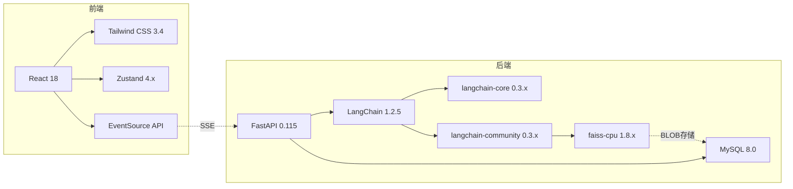

---

### 3. 系统架构设计

#### 3.1 分层架构视图

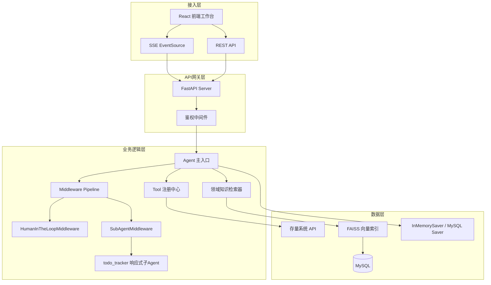

#### 3.2 组件交互视图

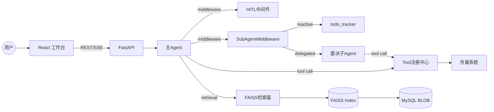

---

### 4. 核心业务流

#### 4.1 主流程：用户输入 → Agent执行 → 流式输出

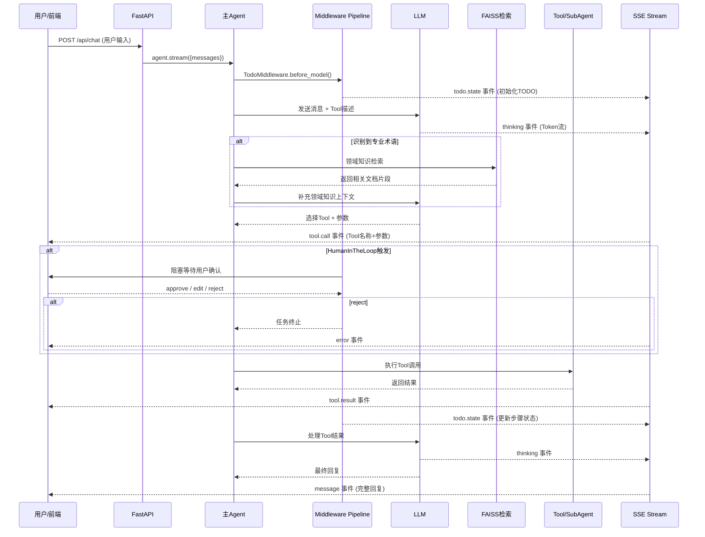

#### 4.2 Human-in-the-Loop 交互流程

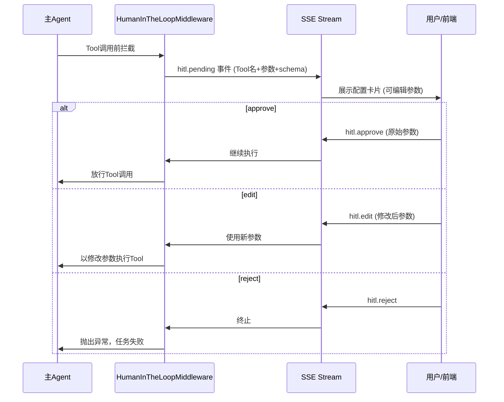

#### 4.3 TODO状态管理流程

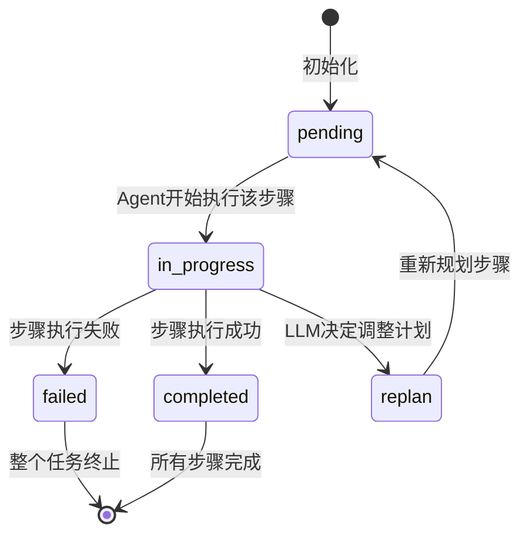

---

### 5. 数据模型设计

#### 5.1 核心实体关系图

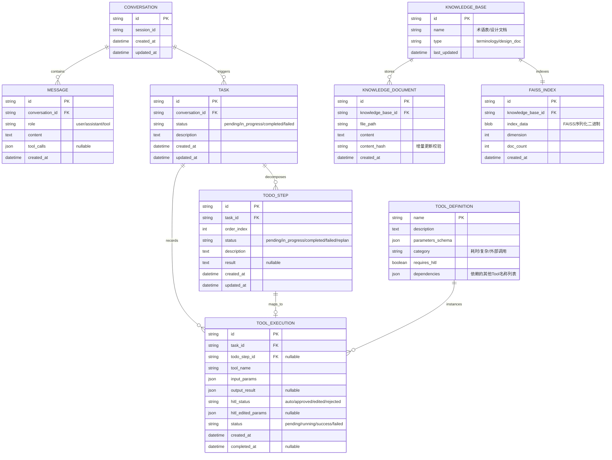

#### 5.2 核心数据库表设计

| 表名 | 字段 | 类型 | 说明 |
| :--- | :--- | :--- | :--- |
| **conversations** | id | VARCHAR(36) PK | UUID |
| | session_id | VARCHAR(36) | 用户会话标识 |
| | created_at | DATETIME | 创建时间 |
| **messages** | id | VARCHAR(36) PK | UUID |
| | conversation_id | VARCHAR(36) FK | 关联会话 |
| | role | ENUM('user','assistant','tool') | 消息角色 |
| | content | TEXT | 消息内容 |
| | tool_calls | JSON | Tool调用信息（nullable） |
| **tasks** | id | VARCHAR(36) PK | UUID |
| | conversation_id | VARCHAR(36) FK | 关联会话 |
| | status | ENUM('pending','in_progress','completed','failed') | 任务状态 |
| | description | TEXT | 任务描述 |
| **todo_steps** | id | VARCHAR(36) PK | UUID |
| | task_id | VARCHAR(36) FK | 关联任务 |
| | order_index | INT | 步骤序号 |
| | status | ENUM('pending','in_progress','completed','failed','replan') | 步骤状态 |
| | description | TEXT | 步骤描述 |
| | result | TEXT | 执行结果（nullable） |
| **tool_executions** | id | VARCHAR(36) PK | UUID |
| | task_id | VARCHAR(36) FK | 关联任务 |
| | tool_name | VARCHAR(128) | Tool名称 |
| | input_params | JSON | 输入参数 |
| | output_result | JSON | 输出结果（nullable） |
| | hitl_status | ENUM('auto','approved','edited','rejected') | HITL决策 |
| | status | ENUM('pending','running','success','failed') | 执行状态 |
| **faiss_indexes** | id | VARCHAR(36) PK | UUID |
| | knowledge_base_id | VARCHAR(36) FK | 关联知识库 |
| | index_data | LONGBLOB | FAISS序列化索引 |
| | dimension | INT | 向量维度 |
| | doc_count | INT | 文档数量 |

---

### 6. API 接口设计

#### 6.1 接口矩阵

| Method | Path | 说明 | 请求体 | 响应 |
| :--- | :--- | :--- | :--- | :--- |
| POST | `/api/chat` | 发起对话（SSE流式） | `ChatRequest` | SSE EventStream |
| POST | `/api/hitl/{execution_id}/decide` | HITL决策提交 | `HITLDecision` | `200 OK` |
| GET | `/api/conversations` | 获取会话列表 | - | `Conversation[]` |
| GET | `/api/conversations/{id}` | 获取会话详情及消息 | - | `ConversationDetail` |
| GET | `/api/tasks/{task_id}/todos` | 获取TODO步骤列表 | - | `TodoStep[]` |
| POST | `/api/knowledge/rebuild` | 触发知识库重建 | `RebuildRequest` | `202 Accepted` |
| GET | `/api/tools` | 获取已注册Tool列表 | - | `ToolDefinition[]` |

#### 6.2 API 交互时序图

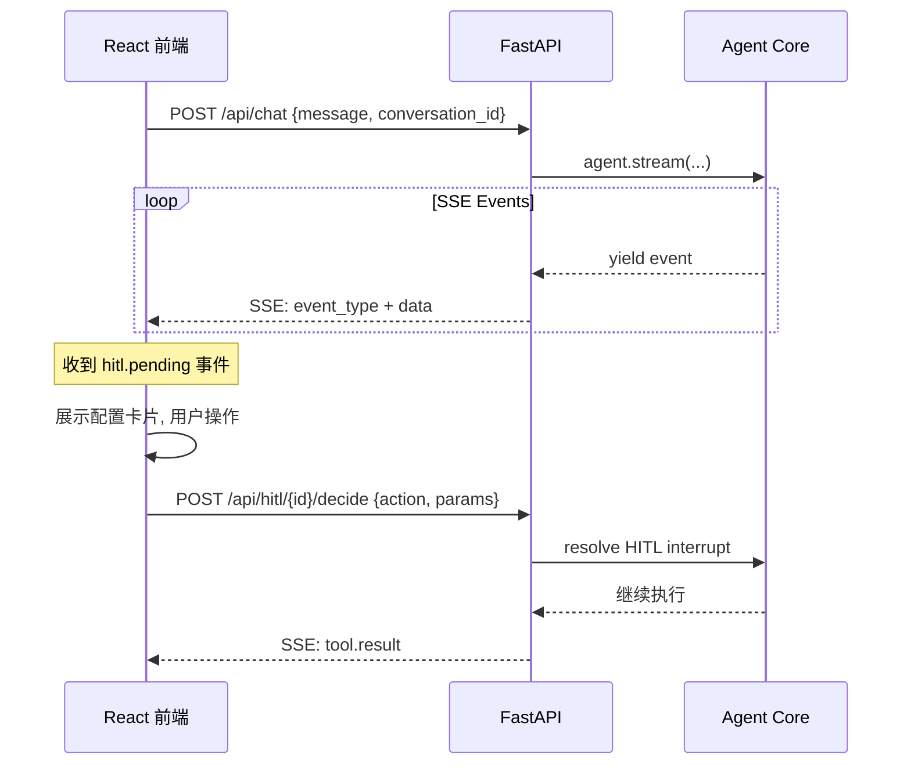

#### 6.3 接口契约

**POST /api/chat - 请求体**
```json
{
  "conversation_id": "string | null",
  "message": "string"
}
```

**SSE Event 格式**
```
event: {event_type}
data: {json_payload}

```

| event_type | data 结构 | 说明 |
| :--- | :--- | :--- |
| `thinking` | `{"token": "string"}` | LLM Token流式输出 |
| `tool.call` | `{"tool_name": "string", "params": {}, "execution_id": "string"}` | Tool调用开始 |
| `tool.result` | `{"execution_id": "string", "result": {}, "status": "success/failed"}` | Tool调用结果 |
| `hitl.pending` | `{"execution_id": "string", "tool_name": "string", "params": {}, "schema": {}}` | 等待HITL决策 |
| `todo.state` | `{"task_id": "string", "steps": [{"id","description","status"}]}` | TODO状态更新 |
| `message` | `{"content": "string"}` | 最终回复 |
| `error` | `{"code": "string", "message": "string"}` | 错误信息 |

**POST /api/hitl/{execution_id}/decide - 请求体**
```json
{
  "action": "approve | edit | reject",
  "edited_params": {}
}
```

**状态码定义**

| 状态码 | 说明 |
| :--- | :--- |
| 200 | 成功 |
| 202 | 已接受（异步处理） |
| 400 | 请求参数错误 |
| 401 | 未授权 |
| 404 | 资源不存在 |
| 500 | 服务器内部错误 |

---

### 7. 前端架构设计

#### 7.1 技术栈

- **框架**：React 18 + TypeScript
- **样式**：Tailwind CSS 3.4（遵循UCD设计规范）
- **状态管理**：Zustand 4.x
- **通信**：EventSource API (SSE) + Fetch API (REST)
- **构建工具**：Vite

#### 7.2 设计系统 Token（基于UCD设计.md）

```typescript
// design-tokens.ts
export const colors = {
  primary:    '#A78BFA', // 薰衣草紫 - 交互高亮、确认按钮
  secondary:  '#60A5FA', // 天空蓝   - 运行中状态
  success:    '#34D399', // 薄荷绿   - 完成状态
  error:      '#F87171', // 珊瑚红   - 失败状态
  background: '#FAFAFA', // 页面背景
  card:       '#FFFFFF', // 组件卡片
  textPrimary:   '#1F2937', // 主文字
  textSecondary: '#6B7280', // 次文字
  textWeak:      '#9CA3AF', // 弱文字
} as const;

export const spacing = {
  grid: 8,     // 8px 基准网格
  gutter: 24,  // 栅格间距
  columns: 12, // 12栏网格
} as const;

export const typography = {
  fontFamily: "'Inter', -apple-system, sans-serif",
} as const;
```

#### 7.3 组件架构拆解

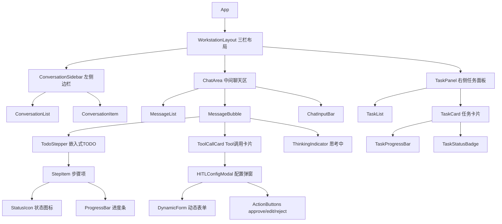

#### 7.4 Zustand Store 设计

```typescript
// stores/chatStore.ts
interface ChatStore {
  // 会话管理
  conversations: Conversation[];
  activeConversationId: string | null;

  // 消息
  messages: Message[];

  // TODO状态
  todoSteps: Record<string, TodoStep[]>; // taskId -> steps

  // HITL
  pendingHITL: HITLPending | null;

  // SSE连接
  sseConnection: EventSource | null;

  // Actions
  sendMessage: (content: string) => void;
  handleSSEEvent: (event: SSEEvent) => void;
  submitHITLDecision: (executionId: string, decision: HITLDecision) => void;
}
```

#### 7.5 三栏布局结构

```
┌──────────────────────────────────────────────────────────┐
│  WINS Agent 工作台                              [用户头像] │
├────────────┬──────────────────────────┬──────────────────┤
│            │                          │                  │
│  对话历史    │   聊天区域                │   任务进度面板    │
│            │                          │                  │
│  ┌──────┐  │  ┌─────────────────────┐ │  ┌────────────┐ │
│  │ 会话1 │  │  │ AI: 我已分析您的需求  │ │  │ 任务#1      │ │
│  ├──────┤  │  │                     │ │  │ ████░░ 4/6  │ │
│  │ 会话2 │  │  │ ┌─ TODO ──────────┐│ │  ├────────────┤ │
│  ├──────┤  │  │ │ ✓ 步骤1 已完成   ││ │  │ 任务#2      │ │
│  │ 会话3 │  │  │ │ ● 步骤2 执行中   ││ │  │ ██░░░░ 2/6  │ │
│  └──────┘  │  │ │ ○ 步骤3 待执行   ││ │  └────────────┘ │
│            │  │ └─────────────────┘│ │                  │
│            │  └─────────────────────┘ │                  │
│            │                          │                  │
│            │  ┌─────────────────────┐ │                  │
│            │  │ [配置卡片 - HITL]    │ │                  │
│            │  │  参数1: [____]      │ │                  │
│            │  │  参数2: [▼ 下拉]    │ │                  │
│            │  │ [Approve] [Reject]  │ │                  │
│            │  └─────────────────────┘ │                  │
│            │                          │                  │
│            │  ┌─────────────────────┐ │                  │
│            │  │ 📎  输入消息...      │ │                  │
│            │  └─────────────────────┘ │                  │
├────────────┴──────────────────────────┴──────────────────┤
│  © WINS Agent                                            │
└──────────────────────────────────────────────────────────┘
```

---

### 8. 关键特性设计

#### 8.1 领域知识管理模块

**架构**：双库分离（术语表库 + 设计文档库），各自独立 FAISS Index。

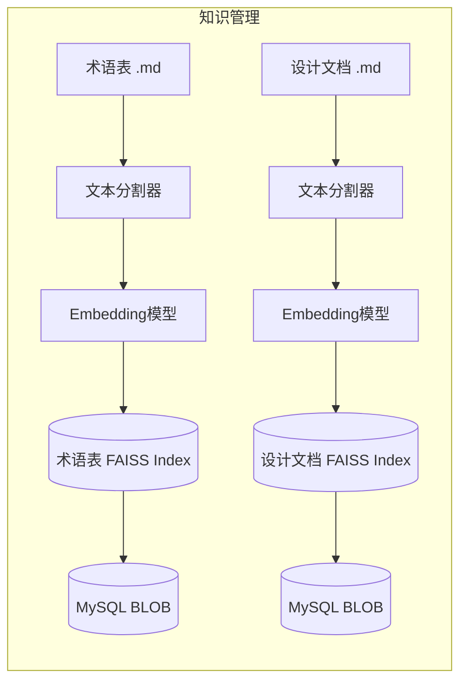

**检索触发机制**：

```python
# 方式：作为Agent的Retrieval Tool，由LLM自主决定何时调用
@tool(response_format="content_and_artifact")
def search_terminology(query: str):
    """当遇到专业术语或需要查询术语定义时，使用此工具检索专业术语表。"""
    docs = terminology_vector_store.similarity_search(query, k=3)
    serialized = "\n\n".join(
        f"术语: {doc.metadata.get('term', 'N/A')}\n定义: {doc.page_content}"
        for doc in docs
    )
    return serialized, docs

@tool(response_format="content_and_artifact")
def search_design_doc(query: str):
    """当需要了解存量系统设计或接口规范时，使用此工具检索系统设计文档。"""
    docs = design_doc_vector_store.similarity_search(query, k=3)
    serialized = "\n\n".join(
        f"来源: {doc.metadata.get('source', 'N/A')}\n内容: {doc.page_content}"
        for doc in docs
    )
    return serialized, docs
```

**增量更新策略**：
1. 计算文档 content_hash（MD5），与数据库中已存记录对比
2. 仅对新增/变更的文档重新生成 Embedding 并追加到 FAISS Index
3. 更新后的 FAISS Index 序列化为二进制存入 MySQL BLOB 字段
4. 更新频率由定时任务控制（具体间隔 TBD）

#### 8.2 Tool编排与注册中心

**设计原则**：
- 每个Tool使用 `@tool` 装饰器封装，description中声明依赖关系
- LLM通过description理解依赖并按序调用（不支持并行调用）
- 支持静态依赖（description中声明）+ 动态推断（LLM根据上下文判断）

```python
from langchain.tools import tool

@tool
def create_order(
    customer_id: str,
    product_codes: list[str],
    quantities: list[int],
    delivery_address: str
):
    """创建订单。依赖关系：调用前需先通过 validate_customer 验证客户有效性，
    并通过 check_inventory 确认库存充足。

    参数说明：
    - customer_id: 客户编码（可通过 search_customer 工具查询）
    - product_codes: 产品编码列表（需符合ERP编码规范）
    - quantities: 对应产品的数量列表
    - delivery_address: 配送地址（需包含省市区）
    """
    # 调用存量系统API
    return legacy_api.create_order(...)
```

**Tool注册中心类图**：

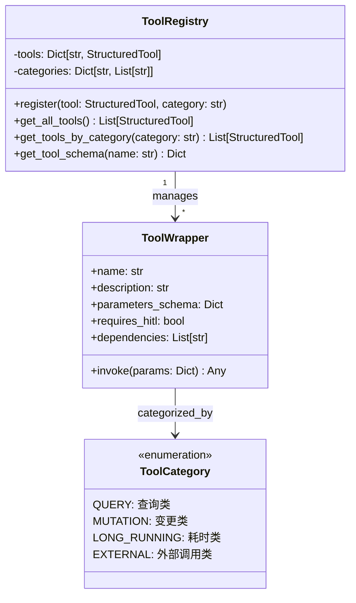

#### 8.3 Agent-as-Tool（SubAgent模式）

> **⚠ 已演进**：本节描述的手工 `@tool` 包装模式已被 **8.7 统一 SubAgent 扩展框架** 取代。框架通过 `SubAgentMiddleware` 自动构建 `task()` tool，实现委派式子 Agent 的统一管理。保留本节供架构对比参考。

基于 LangChain 1.2.5 的 Agent-as-Tool 模式，SubAgent 作为主Agent 的 Tool 被调用：

```python
from langchain.agents import create_agent
from langchain.tools import tool

# 创建专业化SubAgent
data_analysis_agent = create_agent(
    model="...",
    tools=[query_database, generate_chart, export_csv],
    prompt="你是数据分析专家，负责执行数据查询、分析和可视化任务。"
)

# 包装为主Agent的Tool
@tool("data_analysis", description="执行数据分析任务，包括数据查询、统计分析和图表生成。适用于需要多步数据处理的复杂分析请求。")
def call_data_analysis(query: str) -> str:
    """将复杂数据分析任务委派给数据分析专家SubAgent。"""
    result = data_analysis_agent.invoke({
        "messages": [{"role": "user", "content": query}]
    })
    return result["messages"][-1].content

# 主Agent注册SubAgent Tool
main_agent = create_agent(
    model="...",
    tools=[call_data_analysis, ...other_tools],
    middleware=[...],
    prompt="你是AI Agent工作台的主调度器..."
)
```

**SubAgent分发决策**：LLM 根据 Tool description 自主判断是否需要分发给 SubAgent。分发标准建议在 description 中体现：
- 涉及多步骤串行操作
- 属于特定专业领域（数据分析、报表生成等）
- 预计耗时较长的复合任务

#### 8.4 TodoListMiddleware 设计

> **⚠ 已演进**：原生 `TodoListMiddleware` 在多轮对话中存在 TODO 状态停止刷新的问题。已被 **8.7 统一 SubAgent 扩展框架** 中的 `todo_tracker` 响应式子 Agent 取代，通过 `after_model` hook 自动触发独立 LLM 调用来追踪任务进度。保留本节供架构对比参考。

> **LangChain 1.2.5 原生提供** `TodoListMiddleware`（位于 `langchain.agents.middleware.todo`），无需自定义开发。

**工作机制**：
1. 中间件向Agent注入一个 `write_todos` 工具，LLM通过调用此工具来创建/更新TODO列表
2. TODO状态存储在 Agent State 的 `todos` 字段中（`PlanningState`扩展了 `AgentState`）
3. 每个TODO项包含 `content`（内容）和 `status`（pending/in_progress/completed）
4. 中间件通过 `wrap_model_call` 在系统提示中注入TODO管理指令
5. `after_model` 钩子确保 `write_todos` 不被并行调用

```python
from langchain.agents.middleware.todo import TodoListMiddleware

# 直接使用原生中间件
todo_middleware = TodoListMiddleware()

# 可自定义系统提示和工具描述
custom_todo_middleware = TodoListMiddleware(
    system_prompt="请为当前任务制定详细的步骤计划...",
    tool_description="创建或更新当前任务的TODO步骤列表",
)
```

**State Schema 扩展**：
```python
from langchain.agents.middleware.todo import PlanningState, Todo

# PlanningState 自动扩展 AgentState，添加 todos 字段
# Todo TypedDict: {"content": str, "status": "pending" | "in_progress" | "completed"}
```

#### 8.5 HumanInTheLoopMiddleware 集成

使用 LangChain 1.2.5 原生 `HumanInTheLoopMiddleware`：

```python
from langchain.agents import create_agent
from langchain.agents.middleware import HumanInTheLoopMiddleware
from langgraph.checkpoint.memory import InMemorySaver

# 定义需要HITL确认的Tool列表
hitl_tools = {
    "create_order": True,
    "update_customer": True,
    "delete_record": True,
    # ... 敏感操作Tool
}

agent = create_agent(
    llm,
    tools=tool_registry.get_all_tools(),
    prompt=system_prompt,
    middleware=[
        TodoListMiddleware(),  # 自定义
        HumanInTheLoopMiddleware(
            interrupt_on=hitl_tools,
            description_prefix="该操作需要您确认",
        ),
    ],
    checkpointer=InMemorySaver(),
)
```

**前端HITL交互**：
1. Agent执行到需HITL的Tool时，中间件阻塞并通过SSE推送 `hitl.pending` 事件
2. 前端展示动态配置卡片（DynamicForm），表单Schema由Tool的 `parameters_schema` 生成
3. LLM推断的默认值预填入表单
4. 用户选择 approve（确认）/ edit（修改参数）/ reject（拒绝）
5. 前端通过 `POST /api/hitl/{execution_id}/decide` 提交决策
6. 后端 resolve HITL interrupt，Agent继续或终止

#### 8.6 SSE 流式输出设计

```python
from fastapi import FastAPI
from fastapi.responses import StreamingResponse

app = FastAPI()

async def stream_agent_events(conversation_id: str, message: str):
    """生成SSE事件流。"""
    agent_stream = agent.stream(
        {"messages": [{"role": "user", "content": message}]},
        config={"configurable": {"thread_id": conversation_id}},
    )

    for event in agent_stream:
        # 根据事件类型转换为SSE格式
        if "messages" in event:
            msg = event["messages"][-1]
            if hasattr(msg, 'tool_calls') and msg.tool_calls:
                for tc in msg.tool_calls:
                    yield f"event: tool.call\ndata: {json.dumps({'tool_name': tc['name'], 'params': tc['args']})}\n\n"
            elif hasattr(msg, 'content') and msg.content:
                yield f"event: thinking\ndata: {json.dumps({'token': msg.content})}\n\n"

@app.post("/api/chat")
async def chat(request: ChatRequest):
    return StreamingResponse(
        stream_agent_events(request.conversation_id, request.message),
        media_type="text/event-stream",
        headers={
            "Cache-Control": "no-cache",
            "Connection": "keep-alive",
            "X-Accel-Buffering": "no",
        }
    )
```

#### 8.7 统一 SubAgent 扩展框架

> 替代 8.3 Agent-as-Tool 手工包装 和 8.4 TodoListMiddleware 原生中间件，提供统一的子 Agent 注册、编译、触发和状态管理机制。

##### 8.7.1 设计动机

原生 `TodoListMiddleware` 在多轮对话（≥3轮）中出现 TODO 状态停止刷新的问题，根因是 `write_todos` 工具与主 LLM 的工具调用产生竞争。同时，Agent-as-Tool 模式需要为每个 SubAgent 手工编写 `@tool` 包装函数，缺乏统一管理。

统一 SubAgent 扩展框架参考 deepagents `SubAgentMiddleware` 架构，解决以下问题：
- **TODO 刷新稳定性**：子 Agent 独立 LLM 调用，不依赖主 LLM 的工具选择
- **统一管理**：委派式和响应式子 Agent 共用一套注册、编译、调用机制
- **状态隔离**：子 Agent 仅接收精简上下文，不会污染主 Agent 对话历史
- **可扩展性**：新增子 Agent 只需定义配置文件，无需修改框架代码

##### 8.7.2 架构概览

```
主 Agent (create_agent)
 └── SubAgentMiddleware (统一 Middleware)
      ├── delegated 子 Agent → task() tool → 主 LLM 显式委派
      │    └── 状态隔离: messages 过滤, 仅传入 HumanMessage
      │    └── 结果: ToolMessage 返回主 Agent
      └── reactive 子 Agent  → after_model hook → 自动触发
           └── 状态隔离: context_builder 提取精简上下文
           └── 结果: result_parser → state[owned_key] → SSE
```

**两种触发模式：**

| | 委派式 (Delegated) | 响应式 (Reactive) |
|---|---|---|
| 触发方式 | 主 LLM 显式调用 `task()` tool | `after_model` hook 自动触发 |
| 上下文 | 仅传入 `task_description` | `context_builder` 提取精简上下文 |
| 结果处理 | 返回文本作为 ToolMessage | `result_parser` 解析为 state 更新 |
| 典型场景 | 数据分析、报表生成 | TODO 追踪、质量评估 |

**两种执行模式：**

| | Simple 模式 | Full Agent 模式 |
|---|---|---|
| 适用 | 无 tools 的子 Agent | 有 tools 的子 Agent |
| 执行 | 直接 `llm.invoke()` | `create_agent` + `agent.invoke()` |
| 结果 | `result_parser(str)` 解析 LLM 文本 | 从输出 state 提取 `owned_state_keys` |
| 典型场景 | TODO 跟踪器 | 数据分析 Agent |

##### 8.7.3 文件结构

```
backend/app/agent/subagents/
├── __init__.py           # 公共 API 导出
├── types.py              # SubAgentConfig, ReactiveSubAgentConfig, CompiledSubAgent
├── runner.py             # SubAgentRunner (编译 + 调用引擎)
├── middleware.py          # SubAgentMiddleware (统一 Middleware)
└── agents/
    ├── __init__.py       # 子 Agent 配置收集
    └── todo_tracker.py   # TODO 跟踪 reactive 子 Agent (首个消费者)
```

##### 8.7.4 类型系统 (`types.py`)

```python
# Callable 类型别名
ContextBuilder = Callable[[dict[str, Any]], list[BaseMessage] | None]
# 从 parent state 提取精简上下文，返回 None 表示跳过

ResultParser = Callable[[Any], dict[str, Any] | None]
# 解析子 Agent 输出为 state update dict

TriggerCondition = Callable[[dict[str, Any]], bool]
# 判断是否触发 reactive 子 Agent

# 委派式配置（与 deepagents SubAgent 对齐）
class SubAgentConfig(TypedDict):
    name: str                    # 唯一标识符
    description: str             # 功能描述（用作 task() tool 说明）
    system_prompt: str
    tools: Sequence[BaseTool | Callable]
    model: NotRequired[str]      # 空=继承主 Agent

# 响应式配置（deepagents 扩展）
class ReactiveSubAgentConfig(TypedDict):
    name: str
    description: str
    system_prompt: str
    tools: NotRequired[Sequence[...]]  # 空=Simple 模式
    trigger_hook: Literal["after_model"]
    trigger_condition: NotRequired[TriggerCondition]
    context_builder: ContextBuilder     # 必填
    result_parser: NotRequired[ResultParser]
    owned_state_keys: list[str]         # 管理的 state keys
    fallback_on_error: NotRequired[dict]

# 编译后的子 Agent（内部实现）
@dataclass
class CompiledSubAgent:
    name: str
    description: str
    config: SubAgentConfig | ReactiveSubAgentConfig
    runnable: Any = None   # Full Agent 模式
    llm: Any = None        # Simple 模式

    @property
    def is_simple_mode(self) -> bool:
        return self.runnable is None and self.llm is not None
```

##### 8.7.5 执行引擎 (`runner.py`)

`SubAgentRunner` 负责子 Agent 的编译与调用，按 model 标识缓存 LLM 实例。

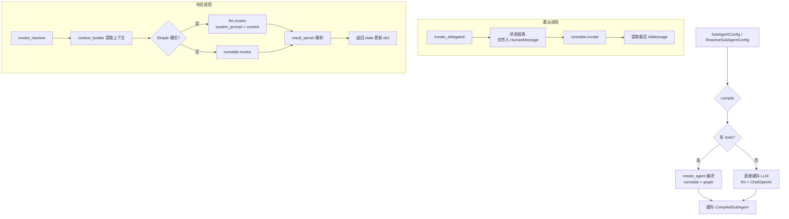

关键设计：
- **LLM 缓存**：按 `model` 标识缓存 `ChatOpenAI` 实例，同模型复用
- **编译缓存**：同名子 Agent 只编译一次
- **错误降级**：响应式调用不抛异常，失败时返回 `fallback_on_error`
- **模型配置**：子 Agent 可指定独立 model，空值时继承主 Agent 模型（通过 `settings.subagent_model` 或 `settings.llm_model`）

##### 8.7.6 统一 Middleware (`middleware.py`)

```python
class SubAgentState(AgentState):
    """扩展 state，声明 reactive 子 Agent 管理的 keys"""
    todos: list[dict[str, Any]]  # todo_tracker 管理

class SubAgentMiddleware(AgentMiddleware[SubAgentState, ContextT]):
    name = "subagent"
    state_schema = SubAgentState

    def __init__(self, delegated=None, reactive=None):
        # 预编译所有子 Agent
        self._delegated = {cfg["name"]: runner.compile(cfg) for cfg in delegated}
        self._reactive_by_hook = ...  # 按 trigger_hook 分组

        # 构建 task() tool（仅当有委派式子 Agent 时）
        self._task_tool = self._build_task_tool() if self._delegated else None

    @property
    def tools(self) -> list[BaseTool]:
        """task() tool，需在 core.py 中加入主 Agent tools 列表"""
        return [self._task_tool] if self._task_tool else []

    def after_model(self, state, runtime) -> dict | None:
        """自动触发 reactive 子 Agent，合并 state 更新"""
        for cfg, compiled in self._reactive_by_hook.get("after_model", []):
            if cfg.trigger_condition and not cfg.trigger_condition(state):
                continue
            update = runner.invoke_reactive(compiled, state)
            merged_updates.update(update)
        return merged_updates
```

**task() tool 工作机制：**

`_build_task_tool()` 动态构建一个 `task(agent_name, task_description)` 工具：
- 自动在 docstring 中列出所有可用委派式子 Agent 及其描述
- 主 LLM 通过 tool description 了解可用子 Agent，自主决定何时委派
- 路由到对应子 Agent，状态隔离执行，仅返回最终结果文本

##### 8.7.7 TODO 跟踪器实现 (`agents/todo_tracker.py`)

作为框架的首个消费者，`todo_tracker` 以 Simple 模式（无 tools）运行：

```python
TODO_TRACKER_CONFIG: ReactiveSubAgentConfig = {
    "name": "todo_tracker",
    "description": "自动追踪和更新任务步骤进度",
    "system_prompt": TODO_SYSTEM_PROMPT,  # JSON 数组输出格式
    # 无 tools → Simple 模式
    "trigger_hook": "after_model",
    "trigger_condition": should_fire,      # 仅 AIMessage 时触发
    "context_builder": build_todo_context, # 提取精简上下文 ≤500 tokens
    "result_parser": parse_todo_result,    # JSON → {"todos": [...]}
    "owned_state_keys": ["todos"],
    "fallback_on_error": {},
}
```

**三个核心函数：**

| 函数 | 职责 | 要点 |
|------|------|------|
| `build_todo_context` | 从 parent state 提取精简上下文 | 提取用户任务（≤300字符）、当前 TODO 状态、最近8条消息摘要（工具调用名/结果状态） |
| `parse_todo_result` | 解析 LLM JSON 输出 | 支持纯 JSON 和 markdown 代码块包裹；规范化 status 值；过滤空 content |
| `should_fire` | 触发条件判断 | 仅当最后一条消息是 `AIMessage` 时触发，跳过 `ToolMessage` 避免不必要的调用 |

**数据流：**

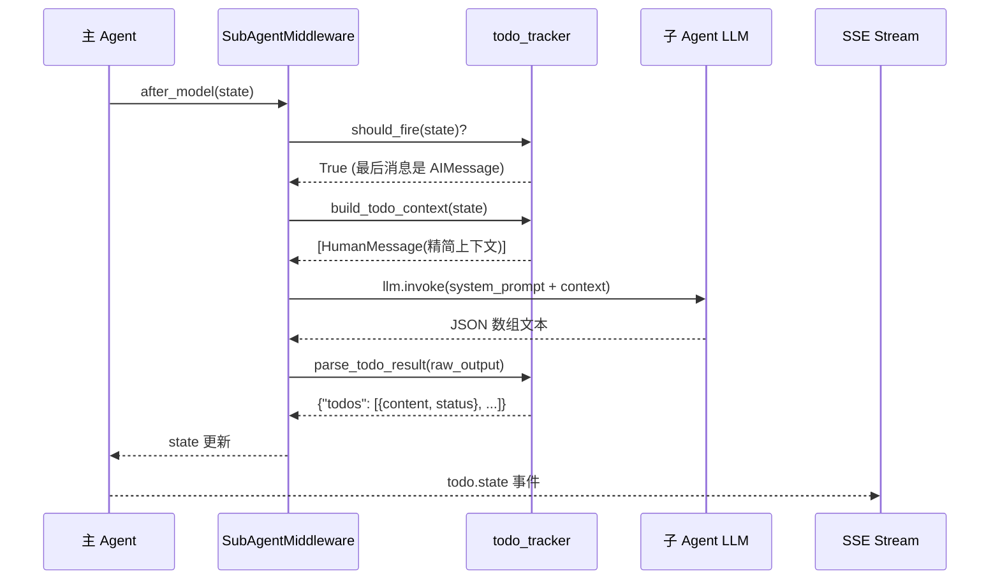

##### 8.7.8 集成方式 (`core.py`)

```python
from app.agent.subagents import SubAgentMiddleware
from app.agent.subagents.agents.todo_tracker import TODO_TRACKER_CONFIG

def build_agent():
    # 创建 SubAgentMiddleware（替代 TodoListMiddleware）
    subagent_mw = SubAgentMiddleware(
        delegated=[],                     # 委派式子 Agent 配置列表
        reactive=[TODO_TRACKER_CONFIG],   # 响应式子 Agent 配置列表
    )

    all_tools = tool_registry.get_all_tools()
    all_tools.extend(subagent_mw.tools)   # 注入 task() tool

    middleware = [
        subagent_mw,                      # 首位：after_model 触发 reactive
        SuggestionsMiddleware(),
        MissingParamsMiddleware(...),
        CustomHumanInTheLoopMiddleware(...),
    ]

    agent = create_agent(
        model=llm,
        tools=all_tools,
        system_prompt=SYSTEM_PROMPT,      # 已删除 write_todos 指令
        middleware=middleware,
        checkpointer=_checkpointer,
    )
```

**配置项** (`config.py`)：
- `SUBAGENT_MODEL`：子 Agent 模型标识符。空值时复用主模型 `LLM_MODEL`。允许为子 Agent 使用更轻量/便宜的模型。

##### 8.7.9 扩展新子 Agent

```python
# 1. 新建 agents/my_agent.py
from app.agent.subagents.types import ReactiveSubAgentConfig

MY_AGENT_CONFIG: ReactiveSubAgentConfig = {
    "name": "my_agent",
    "description": "自定义功能描述",
    "system_prompt": "...",
    "trigger_hook": "after_model",
    "trigger_condition": lambda state: ...,  # 可选
    "context_builder": my_context_builder,
    "result_parser": my_result_parser,
    "owned_state_keys": ["my_key"],
    "fallback_on_error": {},
}

# 2. 在 middleware.py 的 SubAgentState 中声明新 key
class SubAgentState(AgentState):
    todos: list[dict[str, Any]]
    my_key: ...  # 新增

# 3. 在 core.py 中注册
subagent_mw = SubAgentMiddleware(
    reactive=[TODO_TRACKER_CONFIG, MY_AGENT_CONFIG],
)
```

对于委派式子 Agent，定义 `SubAgentConfig`（必须包含 `tools`），加入 `delegated` 列表即可。框架自动将其注册到 `task()` tool 中。

##### 8.7.10 与既有系统的兼容性

| 组件 | 影响 | 说明 |
|------|------|------|
| `event_mapper.py` | **无变化** | 仍检测 `"todos" in val`，SSE 事件格式不变 |
| `api/tasks.py` | **无变化** | 仍读 `state.values.get("todos")` |
| 前端 | **无变化** | 仍接收 `todo.state` 事件，数据结构兼容 |
| 其他 Middleware | **无变化** | Suggestions/MissingParams/HITL 不受影响 |
| 系统提示词 | **已更新** | 删除了 `write_todos` 工具使用指令 |

##### 8.7.11 测试覆盖

| 测试类型 | 文件 | 用例数 | 覆盖内容 |
|----------|------|--------|----------|
| 单元测试（Mock） | `test_types.py` | 10 | 类型定义、Simple/Full 模式判断 |
| 单元测试（Mock） | `test_todo_tracker.py` | 22 | context_builder、result_parser、trigger_condition |
| 单元测试（Mock） | `test_runner.py` | 20 | 编译、委派调用、响应调用、LLM 缓存 |
| 单元测试（Mock） | `test_middleware.py` | 13 | 初始化、after_model hook、task tool 路由 |
| 单元测试（Mock） | `test_integration.py` | 16 | E2E 管道、多轮演进、错误恢复、自定义扩展 |
| 实测（Live LLM） | `test_live.py` | 31 | 真实 LLM 调用、task tool、委派子 Agent、多轮进化 |
| **合计** | | **112** | |

运行方式：
```bash
cd backend

# 单元测试（无需 LLM API）
pytest tests/ -v

# 实测（需配置 .env 中的 LLM API）
pytest tests/test_live.py -v -m live
```

---

### 9. 部署架构设计

#### 验证阶段（开发环境）

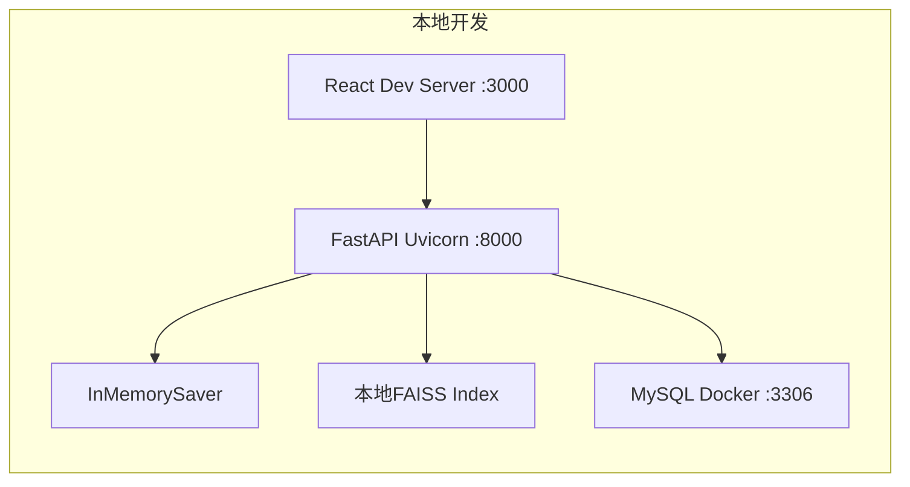

#### 生产环境（待定，建议方案）

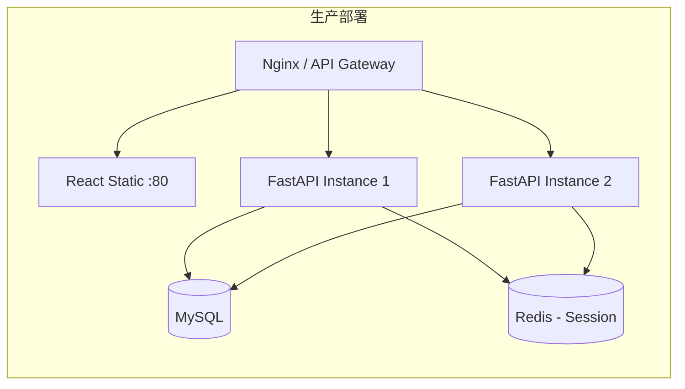

> 注：生产部署架构为建议方案，最终方案待确定（TBD #5）。

---

### 10. 异常处理设计

| 异常场景 | 处理策略 | 前端呈现 |
| :--- | :--- | :--- |
| Tool调用失败 | 整个任务标记为failed，停止执行 | TODO步骤显示红色✗，弹出错误提示 |
| HITL reject | 整个任务标记为failed，停止执行 | TODO步骤显示红色✗，提示"用户已拒绝" |
| TODO步骤失败 | 整个任务标记为failed，不重试/不跳过/不回滚 | 对应步骤红色✗，后续步骤灰色 |
| FAISS检索失败 | 降级为无检索模式继续执行 | 显示warning提示"领域知识暂不可用" |
| SSE连接断开 | 前端自动重连（EventSource 原生支持） | 显示"重新连接中..."状态条 |
| LLM调用超时 | 返回超时错误，任务失败 | 显示超时错误信息 |

---

## 二、开发计划 (Roadmap)

### 1. 优先级排序逻辑

- **P0（核心通路）**：Agent框架搭建、Tool注册与调用、HITL中间件、SSE流式输出
- **P1（功能完整）**：TODO管理、SubAgent、领域知识检索、动态配置UI
- **P2（体验优化）**：UI精修（UCD设计规范）、进度可视化、知识库增量更新、MySQL持久化

### 2. 里程碑规划 (Milestones)

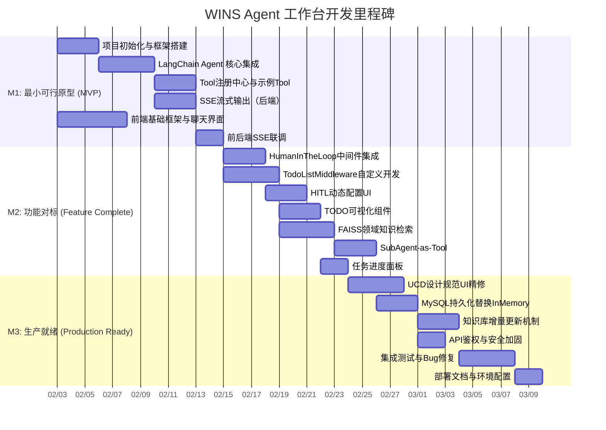

- **M1: 最小可行原型 (MVP)** — 实现 Agent + Tool调用 + SSE流式聊天的端到端通路
- **M2: 功能对标 (Feature Complete)** — 完成全部P0功能（HITL、TODO、知识检索、SubAgent）
- **M3: 生产就绪 (Production Ready)** — UI精修、持久化、安全加固、测试

### 3. 任务分解表 (WBS)

| 阶段 | 任务 | 依赖 |
| :--- | :--- | :--- |
| **M1** | 1.1 Python项目结构初始化（FastAPI + LangChain） | - |
| | 1.2 React前端项目初始化（Vite + Tailwind） | - |
| | 1.3 `create_agent` 集成，单Tool调用验证 | 1.1 |
| | 1.4 ToolRegistry 实现与3个示例Tool | 1.3 |
| | 1.5 SSE StreamingResponse 实现 | 1.3 |
| | 1.6 前端ChatArea组件 + SSE事件处理 | 1.2 |
| | 1.7 前后端联调，端到端流式对话 | 1.5, 1.6 |
| **M2** | 2.1 HumanInTheLoopMiddleware 集成 | 1.7 |
| | 2.2 TodoListMiddleware 自定义开发 | 1.7 |
| | 2.3 HITL前端配置卡片（DynamicForm） | 2.1 |
| | 2.4 TODO Stepper 前端组件 | 2.2 |
| | 2.5 FAISS 双库建设（术语表+设计文档） | 1.7 |
| | 2.6 Retrieval Tool 实现 | 2.5 |
| | 2.7 SubAgent 封装与注册 | 2.6 |
| | 2.8 右侧TaskPanel组件 | 2.4 |
| | 2.9 左侧ConversationSidebar组件 | 1.7 |
| **M3** | 3.1 UCD设计规范全面适配 | 2.8, 2.9 |
| | 3.2 InMemorySaver → MySQL Saver 迁移 | 2.7 |
| | 3.3 FAISS Index MySQL BLOB 存储 | 3.2 |
| | 3.4 知识库增量更新定时任务 | 3.3 |
| | 3.5 API鉴权中间件 | 3.2 |
| | 3.6 集成测试（E2E） | 3.1, 3.4, 3.5 |
| | 3.7 部署文档编写 | 3.6 |

---

## 三、需自定义开发的模块说明

以下模块需自定义开发（LangChain 1.2.5 提供了 `TodoListMiddleware`、`HumanInTheLoopMiddleware` 等原生中间件，已充分利用）：

| 模块 | 说明 | 开发量评估 |
| :--- | :--- | :--- |
| ~~TodoListMiddleware~~ | ~~原生 TodoListMiddleware~~ → 已被 **统一 SubAgent 扩展框架** 中的 `todo_tracker` 响应式子 Agent 取代（见 8.7 节），解决多轮对话 TODO 停止刷新的问题。 | 已完成 |
| **SSE事件分发层** | LangChain 的 `agent.stream()` 返回原始事件流，需自行将其转换为前端所需的结构化 SSE 事件（thinking/tool.call/tool.result/todo.state/hitl.pending）。 | 中 |
| **HITL前端交互桥接** | `HumanInTheLoopMiddleware` 提供了阻塞机制，但前端HITL决策的提交-resolve 通道需自行搭建（基于 checkpointer + `Command(resume=...)` resolve）。 | 中 |
| **FAISS Index MySQL持久化** | LangChain 的 FAISS VectorStore 支持本地文件持久化（`save_local`/`load_local`），但 MySQL BLOB 存储需自行序列化/反序列化。MVP阶段使用文件持久化。 | 低 |
| **知识库增量更新** | 文档 hash 对比 + 增量 Embedding + FAISS Index 追加更新逻辑需自行实现。 | 低 |
| **全部前端UI** | React工作台、三栏布局、TODO Stepper、HITL配置卡片、动态表单等前端组件。 | 高 |

---

## 四、依赖版本锁定建议（requirements.txt）

```txt
langchain==1.2.5
faiss-cpu>=1.8.0,<2.0.0
fastapi>=0.115.0,<1.0.0
uvicorn[standard]>=0.30.0
pydantic>=2.0.0,<3.0.0
pymysql>=1.1.0
sqlalchemy>=2.0.0,<3.0.0
python-dotenv>=1.0.0
```

```json
// package.json (前端核心依赖)
{
  "dependencies": {
    "react": "^18.3.0",
    "react-dom": "^18.3.0",
    "zustand": "^4.5.0",
    "tailwindcss": "^3.4.0"
  },
  "devDependencies": {
    "typescript": "^5.5.0",
    "vite": "^5.4.0",
    "@types/react": "^18.3.0"
  }
}
```
