# AI Agent 工作台 - 技术设计文档

> 基于 LangChain 1.2.5 的智能代理工作台系统技术解决方案与开发计划

---

## 一、解决方案

### 1. 系统概述

- **系统定位**：面向存量系统集成的 AI Agent 工作台，作为用户与100+存量系统 API 之间的智能编排层，自动理解用户意图、检索领域知识、组排 Tool 调用链并以可视化方式呈现执行过程。

- **核心能力矩阵**：

| 能力域 | 核心功能 | 技术支撑 |
| :--- | :--- | :--- |
| 意图理解 | 自然语言意图识别与Tool映射 | LangChain 1.2.5 `create_agent` + LLM tool binding |
| 领域知识 | 专业术语表/设计文档的向量检索 | FAISS + `langchain-community` VectorStore |
| Tool编排 | 100以内Tool的依赖关系管理与串行调用 | `@tool` 装饰器 + description依赖推断 |
| 任务分发 | SubAgent封装为主Agent的Tool | Agent-as-Tool 模式（`@tool` 包装 `invoke`） |
| 人机交互 | Tool调用前的approve/edit/reject | `HumanInTheLoopMiddleware` |
| 流式输出 | Token级实时推送 | SSE + `agent.stream()` |
| TODO管理 | 步骤状态跟踪与可视化 | 自定义 `TodoListMiddleware` |

- **设计约束**：
    - 功能约束：不支持并行Tool调用；Tool/TODO步骤失败不重试不回滚，直接终止任务
    - 性能规格：FAISS检索 ≤ 500ms，SSE延迟 ≤ 100ms，配置面板响应 ≤ 1s
    - 技术约束：必须基于 LangChain 1.2.5，优先使用框架原生特性

---

### 2. 三方件选型与兼容性分析

#### 2.1 选型决策记录 (ADR)

| 组件类别 | 待选方案 | 最终选型 | 理由 (Why) | 潜在风险 |
| :--- | :--- | :--- | :--- | :--- |
| Agent框架 | LangChain 1.2.5 vs LlamaIndex vs 自研 | **LangChain 1.2.5** | 需求强制指定；提供 `create_agent`、`middleware`、`stream` 原生支持 | 1.2.5为新版本，社区案例有限 |
| 向量检索 | FAISS vs ChromaDB vs Milvus | **FAISS (faiss-cpu)** | 需求指定；轻量级、无需独立部署、与 langchain-community 集成成熟 | 单机性能上限，不支持分布式 |
| Embedding模型 | OpenAI Embedding vs HuggingFace | **待定（跟随LLM选型）** | 需与LLM提供商保持一致性 | 多模型混用增加运维成本 |
| 持久化存储 | MySQL vs PostgreSQL vs SQLite | **MySQL** | 需求指定；FAISS Index以BLOB存储；验证阶段用 `InMemorySaver` | BLOB字段查询效率需关注 |
| 前端框架 | React vs Vue vs Svelte | **React + Tailwind CSS** | 需求指定；生态成熟，Tailwind符合UCD设计规范的原子化需求 | 无 |
| 后端框架 | FastAPI vs Flask vs Django | **FastAPI** | 原生支持SSE（`StreamingResponse`）、async、类型安全 | 需引入 `uvicorn` 作为 ASGI 服务器 |
| 状态管理(前端) | Zustand vs Redux vs Jotai | **Zustand** | 轻量级、API简洁、与SSE事件驱动模式契合 | 社区规模小于Redux |
| Checkpointer | InMemorySaver vs MySQL Saver | **InMemorySaver（验证阶段）** | LangChain 1.2.5 原生提供；生产阶段迁移至 MySQL 自定义实现 | 内存数据不持久 |

#### 2.2 技术栈兼容性矩阵

| 核心组件 | 推荐版本 | 兼容性要求/依赖 | 说明 |
| :--- | :--- | :--- | :--- |
| **Python** | 3.11+ | >= 3.10 | LangChain 1.2.5 最低要求 |
| **langchain** | 1.2.5 | 需配合 langchain-core 0.3.x | Agent核心框架 |
| **langchain-community** | 0.3.x | 与 langchain 1.2.5 对齐 | FAISS VectorStore 集成 |
| **faiss-cpu** | 1.8.x | 需 numpy >= 1.24 | 向量检索引擎 |
| **FastAPI** | 0.115.x | 需 uvicorn 0.30+, pydantic v2 | 后端API框架 |
| **React** | 18.x | 需 Node.js >= 18 | 前端框架 |
| **Tailwind CSS** | 3.4.x | 需 PostCSS 8.x | 原子化CSS框架 |
| **MySQL** | 8.0+ | 需 pymysql 或 aiomysql | 持久化存储 |
| **Zustand** | 4.x | React 18+ | 前端状态管理 |

#### 2.3 选型拓扑图

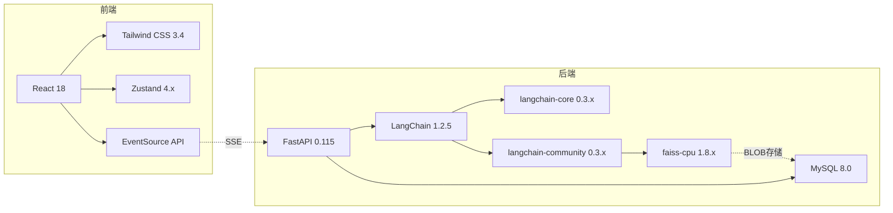

---

### 3. 系统架构设计

#### 3.1 分层架构视图

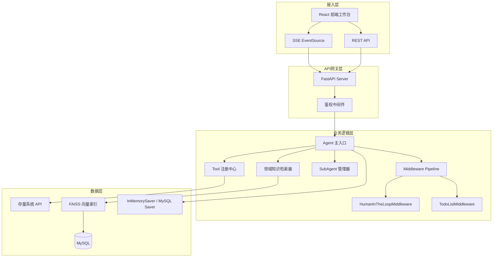

#### 3.2 组件交互视图

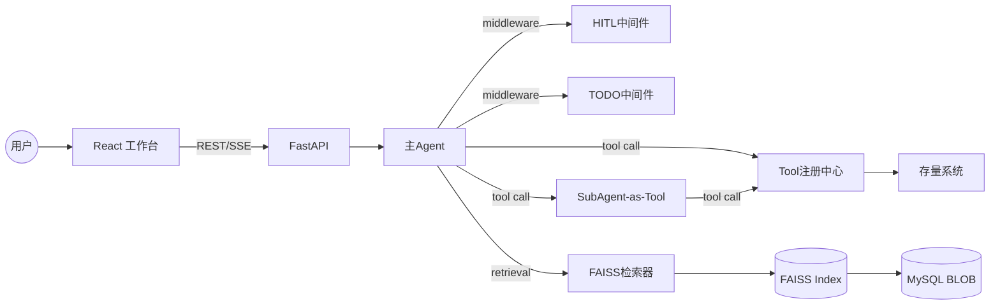

---

### 4. 核心业务流

#### 4.1 主流程：用户输入 → Agent执行 → 流式输出

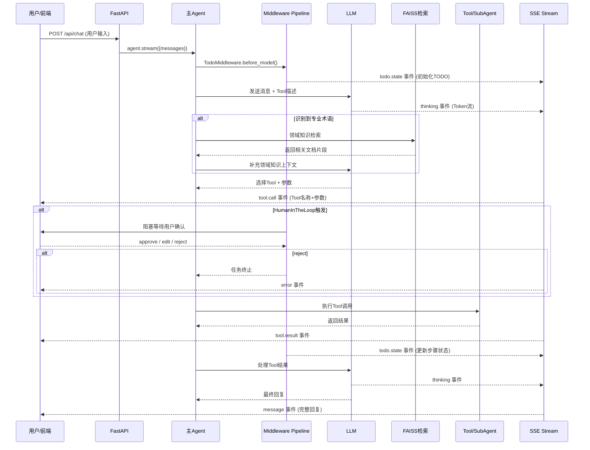

#### 4.2 Human-in-the-Loop 交互流程

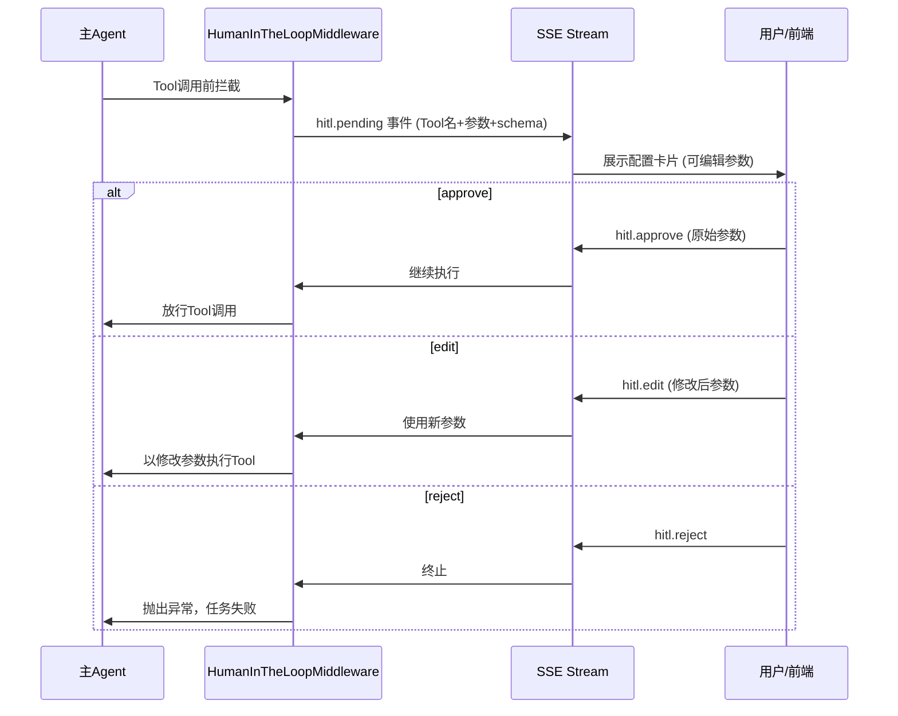

#### 4.3 TODO状态管理流程

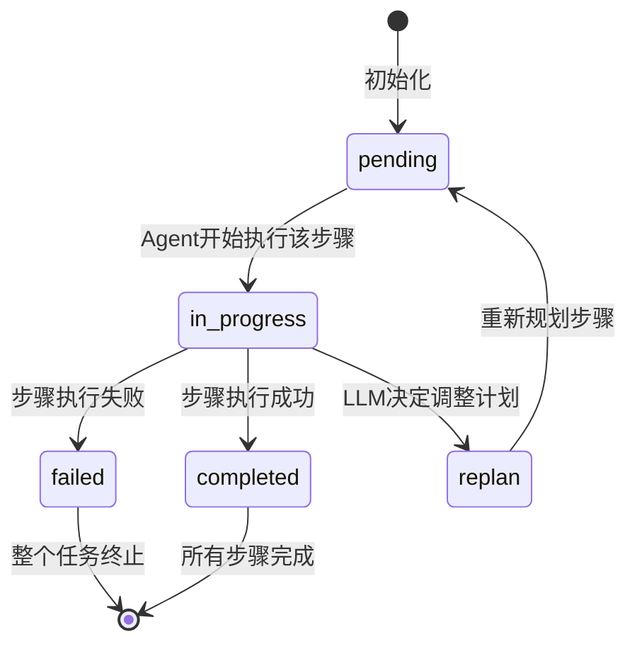

---

### 5. 数据模型设计

#### 5.1 核心实体关系图

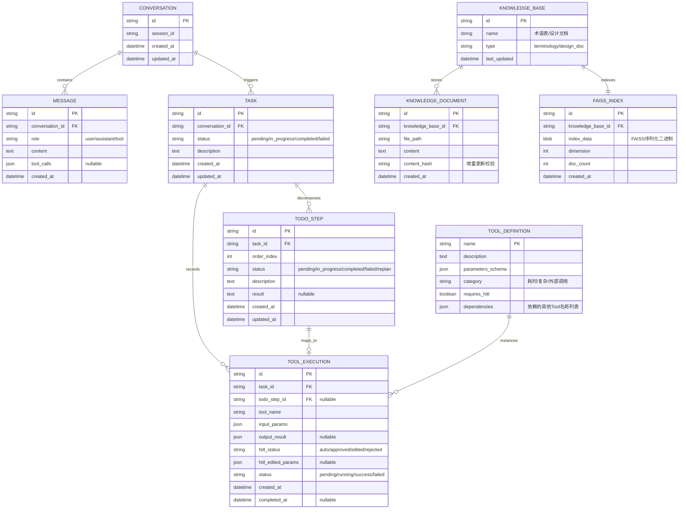

#### 5.2 核心数据库表设计

| 表名 | 字段 | 类型 | 说明 |
| :--- | :--- | :--- | :--- |
| **conversations** | id | VARCHAR(36) PK | UUID |
| | session_id | VARCHAR(36) | 用户会话标识 |
| | created_at | DATETIME | 创建时间 |
| **messages** | id | VARCHAR(36) PK | UUID |
| | conversation_id | VARCHAR(36) FK | 关联会话 |
| | role | ENUM('user','assistant','tool') | 消息角色 |
| | content | TEXT | 消息内容 |
| | tool_calls | JSON | Tool调用信息（nullable） |
| **tasks** | id | VARCHAR(36) PK | UUID |
| | conversation_id | VARCHAR(36) FK | 关联会话 |
| | status | ENUM('pending','in_progress','completed','failed') | 任务状态 |
| | description | TEXT | 任务描述 |
| **todo_steps** | id | VARCHAR(36) PK | UUID |
| | task_id | VARCHAR(36) FK | 关联任务 |
| | order_index | INT | 步骤序号 |
| | status | ENUM('pending','in_progress','completed','failed','replan') | 步骤状态 |
| | description | TEXT | 步骤描述 |
| | result | TEXT | 执行结果（nullable） |
| **tool_executions** | id | VARCHAR(36) PK | UUID |
| | task_id | VARCHAR(36) FK | 关联任务 |
| | tool_name | VARCHAR(128) | Tool名称 |
| | input_params | JSON | 输入参数 |
| | output_result | JSON | 输出结果（nullable） |
| | hitl_status | ENUM('auto','approved','edited','rejected') | HITL决策 |
| | status | ENUM('pending','running','success','failed') | 执行状态 |
| **faiss_indexes** | id | VARCHAR(36) PK | UUID |
| | knowledge_base_id | VARCHAR(36) FK | 关联知识库 |
| | index_data | LONGBLOB | FAISS序列化索引 |
| | dimension | INT | 向量维度 |
| | doc_count | INT | 文档数量 |

---

### 6. API 接口设计

#### 6.1 接口矩阵

| Method | Path | 说明 | 请求体 | 响应 |
| :--- | :--- | :--- | :--- | :--- |
| POST | `/api/chat` | 发起对话（SSE流式） | `ChatRequest` | SSE EventStream |
| POST | `/api/hitl/{execution_id}/decide` | HITL决策提交 | `HITLDecision` | `200 OK` |
| GET | `/api/conversations` | 获取会话列表 | - | `Conversation[]` |
| GET | `/api/conversations/{id}` | 获取会话详情及消息 | - | `ConversationDetail` |
| GET | `/api/tasks/{task_id}/todos` | 获取TODO步骤列表 | - | `TodoStep[]` |
| POST | `/api/knowledge/rebuild` | 触发知识库重建 | `RebuildRequest` | `202 Accepted` |
| GET | `/api/tools` | 获取已注册Tool列表 | - | `ToolDefinition[]` |

#### 6.2 API 交互时序图

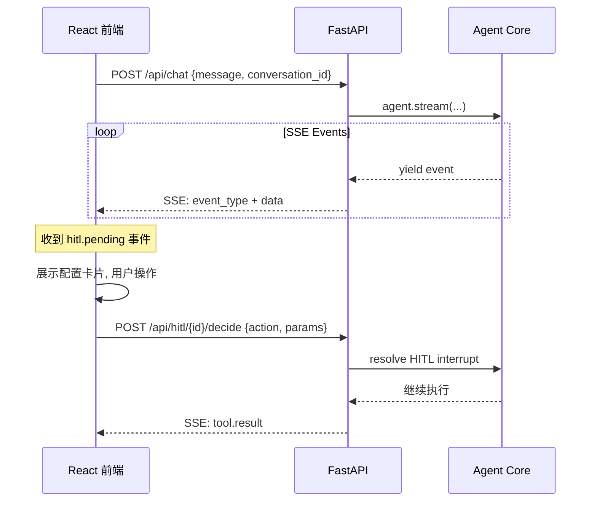

#### 6.3 接口契约

**POST /api/chat - 请求体**
```json
{
  "conversation_id": "string | null",
  "message": "string"
}
```

**SSE Event 格式**
```
event: {event_type}
data: {json_payload}

```

| event_type | data 结构 | 说明 |
| :--- | :--- | :--- |
| `thinking` | `{"token": "string"}` | LLM Token流式输出 |
| `tool.call` | `{"tool_name": "string", "params": {}, "execution_id": "string"}` | Tool调用开始 |
| `tool.result` | `{"execution_id": "string", "result": {}, "status": "success/failed"}` | Tool调用结果 |
| `hitl.pending` | `{"execution_id": "string", "tool_name": "string", "params": {}, "schema": {}}` | 等待HITL决策 |
| `todo.state` | `{"task_id": "string", "steps": [{"id","description","status"}]}` | TODO状态更新 |
| `message` | `{"content": "string"}` | 最终回复 |
| `error` | `{"code": "string", "message": "string"}` | 错误信息 |

**POST /api/hitl/{execution_id}/decide - 请求体**
```json
{
  "action": "approve | edit | reject",
  "edited_params": {}
}
```

**状态码定义**

| 状态码 | 说明 |
| :--- | :--- |
| 200 | 成功 |
| 202 | 已接受（异步处理） |
| 400 | 请求参数错误 |
| 401 | 未授权 |
| 404 | 资源不存在 |
| 500 | 服务器内部错误 |

---

### 7. 前端架构设计

#### 7.1 技术栈

- **框架**：React 18 + TypeScript
- **样式**：Tailwind CSS 3.4（遵循UCD设计规范）
- **状态管理**：Zustand 4.x
- **通信**：EventSource API (SSE) + Fetch API (REST)
- **构建工具**：Vite

#### 7.2 设计系统 Token（基于UCD设计.md）

```typescript
// design-tokens.ts
export const colors = {
  primary:    '#A78BFA', // 薰衣草紫 - 交互高亮、确认按钮
  secondary:  '#60A5FA', // 天空蓝   - 运行中状态
  success:    '#34D399', // 薄荷绿   - 完成状态
  error:      '#F87171', // 珊瑚红   - 失败状态
  background: '#FAFAFA', // 页面背景
  card:       '#FFFFFF', // 组件卡片
  textPrimary:   '#1F2937', // 主文字
  textSecondary: '#6B7280', // 次文字
  textWeak:      '#9CA3AF', // 弱文字
} as const;

export const spacing = {
  grid: 8,     // 8px 基准网格
  gutter: 24,  // 栅格间距
  columns: 12, // 12栏网格
} as const;

export const typography = {
  fontFamily: "'Inter', -apple-system, sans-serif",
} as const;
```

#### 7.3 组件架构拆解

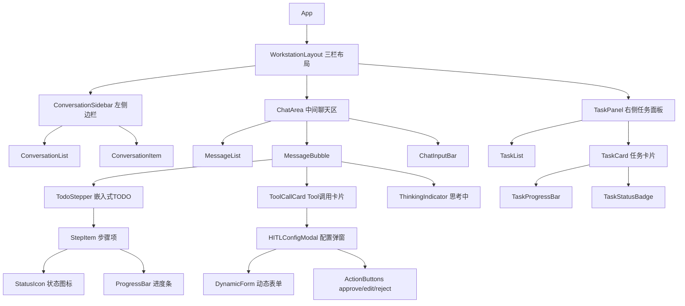

#### 7.4 Zustand Store 设计

```typescript
// stores/chatStore.ts
interface ChatStore {
  // 会话管理
  conversations: Conversation[];
  activeConversationId: string | null;

  // 消息
  messages: Message[];

  // TODO状态
  todoSteps: Record<string, TodoStep[]>; // taskId -> steps

  // HITL
  pendingHITL: HITLPending | null;

  // SSE连接
  sseConnection: EventSource | null;

  // Actions
  sendMessage: (content: string) => void;
  handleSSEEvent: (event: SSEEvent) => void;
  submitHITLDecision: (executionId: string, decision: HITLDecision) => void;
}
```

#### 7.5 三栏布局结构

```
┌──────────────────────────────────────────────────────────┐
│  WINS Agent 工作台                              [用户头像] │
├────────────┬──────────────────────────┬──────────────────┤
│            │                          │                  │
│  对话历史    │   聊天区域                │   任务进度面板    │
│            │                          │                  │
│  ┌──────┐  │  ┌─────────────────────┐ │  ┌────────────┐ │
│  │ 会话1 │  │  │ AI: 我已分析您的需求  │ │  │ 任务#1      │ │
│  ├──────┤  │  │                     │ │  │ ████░░ 4/6  │ │
│  │ 会话2 │  │  │ ┌─ TODO ──────────┐│ │  ├────────────┤ │
│  ├──────┤  │  │ │ ✓ 步骤1 已完成   ││ │  │ 任务#2      │ │
│  │ 会话3 │  │  │ │ ● 步骤2 执行中   ││ │  │ ██░░░░ 2/6  │ │
│  └──────┘  │  │ │ ○ 步骤3 待执行   ││ │  └────────────┘ │
│            │  │ └─────────────────┘│ │                  │
│            │  └─────────────────────┘ │                  │
│            │                          │                  │
│            │  ┌─────────────────────┐ │                  │
│            │  │ [配置卡片 - HITL]    │ │                  │
│            │  │  参数1: [____]      │ │                  │
│            │  │  参数2: [▼ 下拉]    │ │                  │
│            │  │ [Approve] [Reject]  │ │                  │
│            │  └─────────────────────┘ │                  │
│            │                          │                  │
│            │  ┌─────────────────────┐ │                  │
│            │  │ 📎  输入消息...      │ │                  │
│            │  └─────────────────────┘ │                  │
├────────────┴──────────────────────────┴──────────────────┤
│  © WINS Agent                                            │
└──────────────────────────────────────────────────────────┘
```

---

### 8. 关键特性设计

#### 8.1 领域知识管理模块

**架构**：双库分离（术语表库 + 设计文档库），各自独立 FAISS Index。

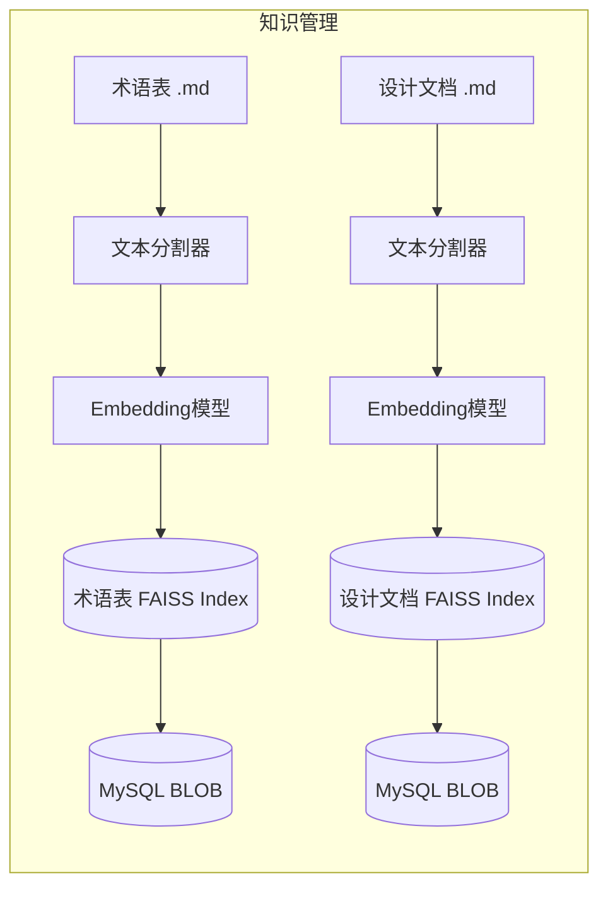

**检索触发机制**：

```python
# 方式：作为Agent的Retrieval Tool，由LLM自主决定何时调用
@tool(response_format="content_and_artifact")
def search_terminology(query: str):
    """当遇到专业术语或需要查询术语定义时，使用此工具检索专业术语表。"""
    docs = terminology_vector_store.similarity_search(query, k=3)
    serialized = "\n\n".join(
        f"术语: {doc.metadata.get('term', 'N/A')}\n定义: {doc.page_content}"
        for doc in docs
    )
    return serialized, docs

@tool(response_format="content_and_artifact")
def search_design_doc(query: str):
    """当需要了解存量系统设计或接口规范时，使用此工具检索系统设计文档。"""
    docs = design_doc_vector_store.similarity_search(query, k=3)
    serialized = "\n\n".join(
        f"来源: {doc.metadata.get('source', 'N/A')}\n内容: {doc.page_content}"
        for doc in docs
    )
    return serialized, docs
```

**增量更新策略**：
1. 计算文档 content_hash（MD5），与数据库中已存记录对比
2. 仅对新增/变更的文档重新生成 Embedding 并追加到 FAISS Index
3. 更新后的 FAISS Index 序列化为二进制存入 MySQL BLOB 字段
4. 更新频率由定时任务控制（具体间隔 TBD）

#### 8.2 Tool编排与注册中心

**设计原则**：
- 每个Tool使用 `@tool` 装饰器封装，description中声明依赖关系
- LLM通过description理解依赖并按序调用（不支持并行调用）
- 支持静态依赖（description中声明）+ 动态推断（LLM根据上下文判断）

```python
from langchain.tools import tool

@tool
def create_order(
    customer_id: str,
    product_codes: list[str],
    quantities: list[int],
    delivery_address: str
):
    """创建订单。依赖关系：调用前需先通过 validate_customer 验证客户有效性，
    并通过 check_inventory 确认库存充足。

    参数说明：
    - customer_id: 客户编码（可通过 search_customer 工具查询）
    - product_codes: 产品编码列表（需符合ERP编码规范）
    - quantities: 对应产品的数量列表
    - delivery_address: 配送地址（需包含省市区）
    """
    # 调用存量系统API
    return legacy_api.create_order(...)
```

**Tool注册中心类图**：

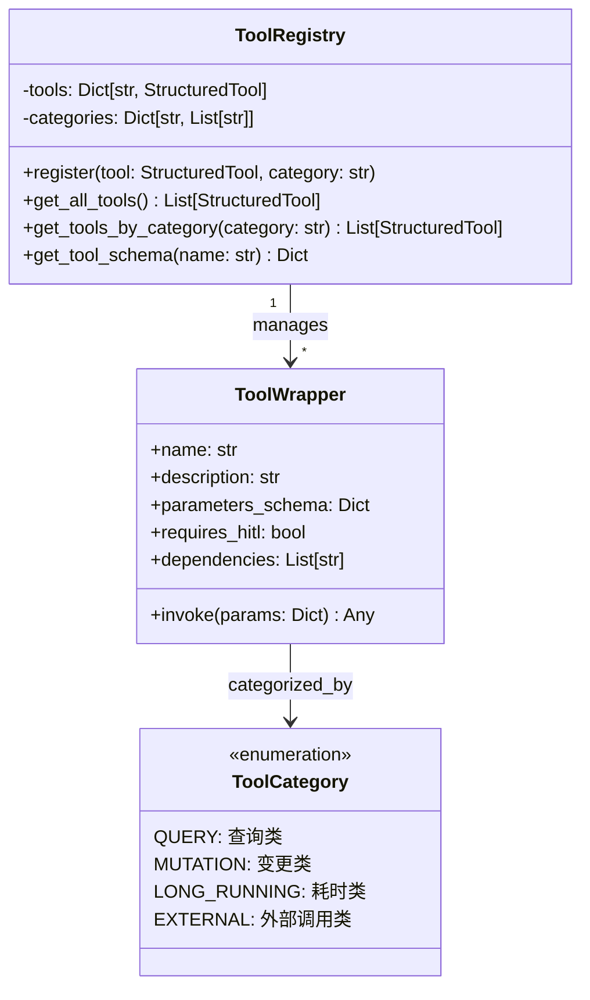

#### 8.3 Agent-as-Tool（SubAgent模式）

基于 LangChain 1.2.5 的 Agent-as-Tool 模式，SubAgent 作为主Agent 的 Tool 被调用：

```python
from langchain.agents import create_agent
from langchain.tools import tool

# 创建专业化SubAgent
data_analysis_agent = create_agent(
    model="...",
    tools=[query_database, generate_chart, export_csv],
    prompt="你是数据分析专家，负责执行数据查询、分析和可视化任务。"
)

# 包装为主Agent的Tool
@tool("data_analysis", description="执行数据分析任务，包括数据查询、统计分析和图表生成。适用于需要多步数据处理的复杂分析请求。")
def call_data_analysis(query: str) -> str:
    """将复杂数据分析任务委派给数据分析专家SubAgent。"""
    result = data_analysis_agent.invoke({
        "messages": [{"role": "user", "content": query}]
    })
    return result["messages"][-1].content

# 主Agent注册SubAgent Tool
main_agent = create_agent(
    model="...",
    tools=[call_data_analysis, ...other_tools],
    middleware=[...],
    prompt="你是AI Agent工作台的主调度器..."
)
```

**SubAgent分发决策**：LLM 根据 Tool description 自主判断是否需要分发给 SubAgent。分发标准建议在 description 中体现：
- 涉及多步骤串行操作
- 属于特定专业领域（数据分析、报表生成等）
- 预计耗时较长的复合任务

#### 8.4 TodoListMiddleware 设计

> **注意**：LangChain 1.2.5 未提供 `TodoListMiddleware` 预建中间件。需基于 `AgentMiddleware` 基类自定义实现。

```python
from langchain.agents.middleware import AgentMiddleware

class TodoListMiddleware(AgentMiddleware):
    """自定义TODO管理中间件，跟踪Agent任务步骤状态。"""

    def __init__(self):
        self.steps: list[dict] = []
        self.current_step_index: int = -1
        self.task_id: str | None = None

    async def before_model(self, state, config):
        """模型调用前：检查当前TODO状态，注入步骤上下文。"""
        if self.steps:
            todo_context = self._format_todo_context()
            # 将TODO状态注入到系统消息中
            state["messages"].insert(0, {
                "role": "system",
                "content": f"当前任务步骤状态:\n{todo_context}\n请根据步骤计划继续执行。"
            })
        return state

    async def after_model(self, state, config):
        """模型调用后：解析LLM输出，更新步骤状态。"""
        last_message = state["messages"][-1]
        # 解析LLM是否输出了新的TODO计划或状态变更
        self._parse_and_update_steps(last_message)
        # 通过回调通知前端
        if config.get("callbacks"):
            await self._emit_todo_state(config["callbacks"])
        return state

    async def before_tool(self, tool_call, config):
        """Tool调用前：将对应步骤标记为 in_progress。"""
        self._advance_step("in_progress")
        return tool_call

    async def after_tool(self, tool_result, config):
        """Tool调用后：根据结果更新步骤状态。"""
        if tool_result.get("error"):
            self._advance_step("failed")
        else:
            self._advance_step("completed")
        return tool_result

    def _format_todo_context(self) -> str:
        status_icons = {
            "pending": "○", "in_progress": "●",
            "completed": "✓", "failed": "✗", "replan": "↻"
        }
        lines = []
        for i, step in enumerate(self.steps):
            icon = status_icons.get(step["status"], "?")
            lines.append(f"  {icon} 步骤{i+1}: {step['description']} [{step['status']}]")
        return "\n".join(lines)

    def _advance_step(self, status: str):
        if 0 <= self.current_step_index < len(self.steps):
            self.steps[self.current_step_index]["status"] = status

    def _parse_and_update_steps(self, message):
        # 解析LLM输出中的TODO计划（格式约定）
        pass

    async def _emit_todo_state(self, callbacks):
        # 发送todo.state SSE事件
        pass
```

#### 8.5 HumanInTheLoopMiddleware 集成

使用 LangChain 1.2.5 原生 `HumanInTheLoopMiddleware`：

```python
from langchain.agents import create_agent
from langchain.agents.middleware import HumanInTheLoopMiddleware
from langgraph.checkpoint.memory import InMemorySaver

# 定义需要HITL确认的Tool列表
hitl_tools = {
    "create_order": True,
    "update_customer": True,
    "delete_record": True,
    # ... 敏感操作Tool
}

agent = create_agent(
    llm,
    tools=tool_registry.get_all_tools(),
    prompt=system_prompt,
    middleware=[
        TodoListMiddleware(),  # 自定义
        HumanInTheLoopMiddleware(
            interrupt_on=hitl_tools,
            description_prefix="该操作需要您确认",
        ),
    ],
    checkpointer=InMemorySaver(),
)
```

**前端HITL交互**：
1. Agent执行到需HITL的Tool时，中间件阻塞并通过SSE推送 `hitl.pending` 事件
2. 前端展示动态配置卡片（DynamicForm），表单Schema由Tool的 `parameters_schema` 生成
3. LLM推断的默认值预填入表单
4. 用户选择 approve（确认）/ edit（修改参数）/ reject（拒绝）
5. 前端通过 `POST /api/hitl/{execution_id}/decide` 提交决策
6. 后端 resolve HITL interrupt，Agent继续或终止

#### 8.6 SSE 流式输出设计

```python
from fastapi import FastAPI
from fastapi.responses import StreamingResponse

app = FastAPI()

async def stream_agent_events(conversation_id: str, message: str):
    """生成SSE事件流。"""
    agent_stream = agent.stream(
        {"messages": [{"role": "user", "content": message}]},
        config={"configurable": {"thread_id": conversation_id}},
    )

    for event in agent_stream:
        # 根据事件类型转换为SSE格式
        if "messages" in event:
            msg = event["messages"][-1]
            if hasattr(msg, 'tool_calls') and msg.tool_calls:
                for tc in msg.tool_calls:
                    yield f"event: tool.call\ndata: {json.dumps({'tool_name': tc['name'], 'params': tc['args']})}\n\n"
            elif hasattr(msg, 'content') and msg.content:
                yield f"event: thinking\ndata: {json.dumps({'token': msg.content})}\n\n"

@app.post("/api/chat")
async def chat(request: ChatRequest):
    return StreamingResponse(
        stream_agent_events(request.conversation_id, request.message),
        media_type="text/event-stream",
        headers={
            "Cache-Control": "no-cache",
            "Connection": "keep-alive",
            "X-Accel-Buffering": "no",
        }
    )
```

---

### 9. 部署架构设计

#### 验证阶段（开发环境）

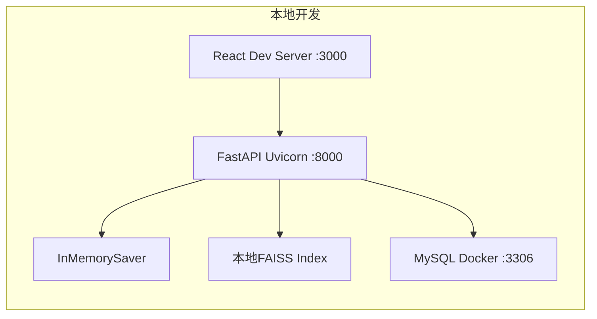

#### 生产环境（待定，建议方案）

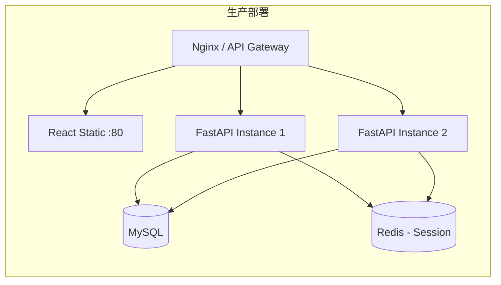

> 注：生产部署架构为建议方案，最终方案待确定（TBD #5）。

---

### 10. 异常处理设计

| 异常场景 | 处理策略 | 前端呈现 |
| :--- | :--- | :--- |
| Tool调用失败 | 整个任务标记为failed，停止执行 | TODO步骤显示红色✗，弹出错误提示 |
| HITL reject | 整个任务标记为failed，停止执行 | TODO步骤显示红色✗，提示"用户已拒绝" |
| TODO步骤失败 | 整个任务标记为failed，不重试/不跳过/不回滚 | 对应步骤红色✗，后续步骤灰色 |
| FAISS检索失败 | 降级为无检索模式继续执行 | 显示warning提示"领域知识暂不可用" |
| SSE连接断开 | 前端自动重连（EventSource 原生支持） | 显示"重新连接中..."状态条 |
| LLM调用超时 | 返回超时错误，任务失败 | 显示超时错误信息 |

---

## 二、开发计划 (Roadmap)

### 1. 优先级排序逻辑

- **P0（核心通路）**：Agent框架搭建、Tool注册与调用、HITL中间件、SSE流式输出
- **P1（功能完整）**：TODO管理、SubAgent、领域知识检索、动态配置UI
- **P2（体验优化）**：UI精修（UCD设计规范）、进度可视化、知识库增量更新、MySQL持久化

### 2. 里程碑规划 (Milestones)

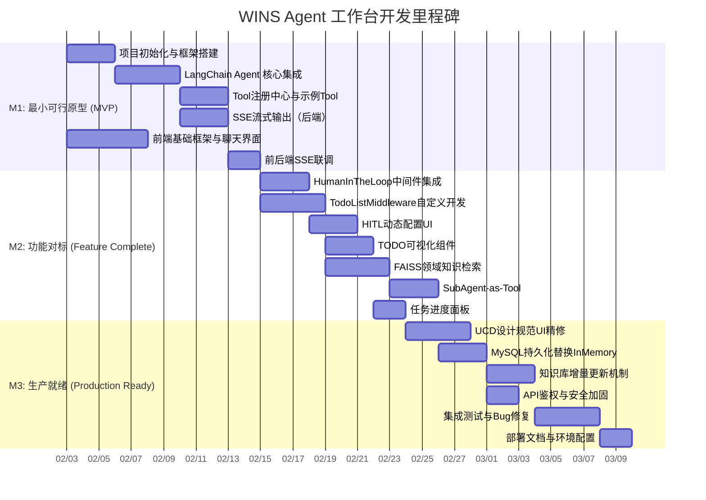

- **M1: 最小可行原型 (MVP)** — 实现 Agent + Tool调用 + SSE流式聊天的端到端通路
- **M2: 功能对标 (Feature Complete)** — 完成全部P0功能（HITL、TODO、知识检索、SubAgent）
- **M3: 生产就绪 (Production Ready)** — UI精修、持久化、安全加固、测试

### 3. 任务分解表 (WBS)

| 阶段 | 任务 | 依赖 |
| :--- | :--- | :--- |
| **M1** | 1.1 Python项目结构初始化（FastAPI + LangChain） | - |
| | 1.2 React前端项目初始化（Vite + Tailwind） | - |
| | 1.3 `create_agent` 集成，单Tool调用验证 | 1.1 |
| | 1.4 ToolRegistry 实现与3个示例Tool | 1.3 |
| | 1.5 SSE StreamingResponse 实现 | 1.3 |
| | 1.6 前端ChatArea组件 + SSE事件处理 | 1.2 |
| | 1.7 前后端联调，端到端流式对话 | 1.5, 1.6 |
| **M2** | 2.1 HumanInTheLoopMiddleware 集成 | 1.7 |
| | 2.2 TodoListMiddleware 自定义开发 | 1.7 |
| | 2.3 HITL前端配置卡片（DynamicForm） | 2.1 |
| | 2.4 TODO Stepper 前端组件 | 2.2 |
| | 2.5 FAISS 双库建设（术语表+设计文档） | 1.7 |
| | 2.6 Retrieval Tool 实现 | 2.5 |
| | 2.7 SubAgent 封装与注册 | 2.6 |
| | 2.8 右侧TaskPanel组件 | 2.4 |
| | 2.9 左侧ConversationSidebar组件 | 1.7 |
| **M3** | 3.1 UCD设计规范全面适配 | 2.8, 2.9 |
| | 3.2 InMemorySaver → MySQL Saver 迁移 | 2.7 |
| | 3.3 FAISS Index MySQL BLOB 存储 | 3.2 |
| | 3.4 知识库增量更新定时任务 | 3.3 |
| | 3.5 API鉴权中间件 | 3.2 |
| | 3.6 集成测试（E2E） | 3.1, 3.4, 3.5 |
| | 3.7 部署文档编写 | 3.6 |

---

## 三、需自定义开发的模块说明

以下模块 **LangChain 1.2.5 未提供开箱即用的实现**，需自定义开发：

| 模块 | 说明 | 开发量评估 |
| :--- | :--- | :--- |
| **TodoListMiddleware** | LangChain 1.2.5 仅提供 `HumanInTheLoopMiddleware`、`SummarizationMiddleware`、`PIIRedactionMiddleware` 三个预建中间件，不含 TODO 管理。需基于 `AgentMiddleware` 基类自定义实现。 | 中 |
| **SSE事件分发层** | LangChain 的 `agent.stream()` 返回原始事件流，需自行将其转换为前端所需的结构化 SSE 事件（thinking/tool.call/tool.result/todo.state/hitl.pending）。 | 中 |
| **HITL前端交互桥接** | `HumanInTheLoopMiddleware` 提供了阻塞机制，但前端HITL决策的提交-resolve 通道需自行搭建（基于 checkpointer + interrupt resolve）。 | 中 |
| **FAISS Index MySQL持久化** | LangChain 的 FAISS VectorStore 支持本地文件持久化（`save_local`/`load_local`），但 MySQL BLOB 存储需自行序列化/反序列化。 | 低 |
| **知识库增量更新** | 文档 hash 对比 + 增量 Embedding + FAISS Index 追加更新逻辑需自行实现。 | 低 |
| **全部前端UI** | React工作台、三栏布局、TODO Stepper、HITL配置卡片、动态表单等前端组件。 | 高 |

---

## 四、依赖版本锁定建议（requirements.txt）

```txt
langchain==1.2.5
faiss-cpu>=1.8.0,<2.0.0
fastapi>=0.115.0,<1.0.0
uvicorn[standard]>=0.30.0
pydantic>=2.0.0,<3.0.0
pymysql>=1.1.0
sqlalchemy>=2.0.0,<3.0.0
python-dotenv>=1.0.0
```

```json
// package.json (前端核心依赖)
{
  "dependencies": {
    "react": "^18.3.0",
    "react-dom": "^18.3.0",
    "zustand": "^4.5.0",
    "tailwindcss": "^3.4.0"
  },
  "devDependencies": {
    "typescript": "^5.5.0",
    "vite": "^5.4.0",
    "@types/react": "^18.3.0"
  }
}
```
